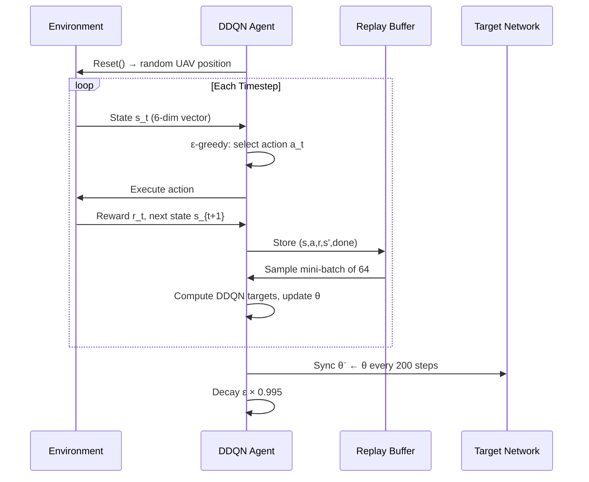

# 🎓 ML-Based Trajectory Optimisation for UAV Enabled 5G Communication
## Complete Viva & Presentation Preparation Guide
**Raj Pohekar | B400050221 | PICT, Pune | AY 2025–26 | Guide: Prof. A.K. Patel**

---

> **⚠️ EXAMINER NOTE:** Your paper is accepted at ICCCnet 2026 (Springer LNNS) and VIT Mauritius Springer Conference. Lead with this — it immediately establishes research credibility.

---

## Table of Contents

1. [Elevator Pitch](#1-elevator-pitch)
2. [2-Minute Explanation](#2-2-minute-explanation)
3. [5-Minute Presentation Script](#3-5-minute-presentation-script)
4. [Problem Statement](#4-problem-statement)
5. [Background Theory](#5-background-theory)
6. [Domain Knowledge](#6-domain-knowledge)
7. [Architecture Explanation](#7-architecture-explanation)
8. [Project Workflow](#8-project-workflow)
9. [Module-by-Module Explanation](#9-module-by-module-explanation)
10. [Algorithm Deep Dive](#10-algorithm-deep-dive)
11. [Mathematical Derivations](#11-mathematical-derivations)
12. [Design Decisions](#12-design-decisions)
13. [Implementation Details](#13-implementation-details)
14. [Code Walkthrough](#14-code-walkthrough)
15. [Results Analysis](#15-results-analysis)
16. [Performance Metrics](#16-performance-metrics)
17. [Research Paper Contribution](#17-research-paper-contribution)
18. [Comparison Tables](#18-comparison-tables)
19. [Limitations](#19-limitations)
20. [Future Scope](#20-future-scope)
21. [Real-Life Applications](#21-real-life-applications)
22. [100+ Viva Questions with Answers](#22-100-viva-questions-with-answers)
23. [Cross Questions](#23-cross-questions)
24. [Technical Interview Questions](#24-technical-interview-questions)
25. [Common Mistakes to Avoid](#25-common-mistakes-to-avoid)
26. [Difficult Concepts Explained](#26-difficult-concepts-explained)
27. [5-Page Quick Revision Notes](#27-5-page-quick-revision-notes)
28. [One-Day Revision](#28-one-day-revision)
29. [One-Hour Revision](#29-one-hour-revision)
30. [Cheat Sheet](#30-cheat-sheet)
31. [100 Keywords](#31-100-keywords)
32. [Crisp Definitions](#32-crisp-definitions)
33. [Project Defense](#33-project-defense)
34. [Presentation Tips](#34-presentation-tips)
35. [Final Viva Checklist](#35-final-viva-checklist)

---

## 1. Elevator Pitch

### Script (30–60 seconds)

> "Our project addresses a critical communication challenge: during disasters, concerts, or emergencies, existing 5G base stations become overloaded or damaged, leaving ground users without connectivity. We deploy a UAV — a drone — as an aerial relay to bridge that gap. But simply deploying a drone isn't enough; **where** the drone flies determines everything — the signal strength, data rate, and battery life.
>
> We solved the trajectory planning problem using **Deep Reinforcement Learning**, specifically a Double Deep Q-Network or DDQN. The UAV learns — by trial and error over 2,000 training episodes — to autonomously navigate to the optimal position that simultaneously maximises the signal from the base station AND the coverage to ground users.
>
> The results are compelling: **18–25% improvement in average data rate**, **5 dBm gain in signal strength**, and a **25 percentage-point reduction** in users receiving poor coverage. This work has been accepted for publication in a Springer-indexed conference, ICCCnet 2026.
>
> In short: we taught a drone to think — and it found the best position a human planner couldn't easily compute."

---

## 2. 2-Minute Explanation

> **Use this at the start of your presentation.**

"Good morning. I am Raj Pohekar, and our project is titled *ML-Based Trajectory Optimisation for UAV-Enabled 5G Communication*.

**The Problem:** Fifth-generation wireless networks are designed for reliability and high throughput, but they depend on terrestrial base stations. In disaster scenarios, large public events, or remote areas, these base stations either fail, get overloaded, or simply don't exist. The result: ground users lose connectivity when they need it most.

**Our Solution:** We propose deploying an Unmanned Aerial Vehicle — a UAV or drone — as a flying relay between an existing base station and ground users. The UAV exploits its elevated position to establish near-LoS — Line-of-Sight — air-to-ground links, dramatically reducing path loss.

**The Core Innovation:** The key insight is that the UAV's *trajectory* — where it flies — determines every aspect of performance: signal strength, data rate, fairness, and energy consumption. We formulated this trajectory planning problem as a **Markov Decision Process** and solved it using a **Double Deep Q-Network (DDQN)** reinforcement learning algorithm. The UAV agent explores the environment, receives rewards for good positioning, and learns an optimal flight policy over 2,000 training episodes.

**The Evaluation:** We trained the system in Python and evaluated it using a MATLAB communication framework that computes SINR, Shannon capacity, coverage heatmaps, and CDFs of user data rates — both before and after optimisation.

**Key Results:**
- Average data rate improved by **18–25%** (325 Mbps → 390 Mbps)
- Signal strength improved by **~5 dBm** for distant users
- Coverage probability improved from **0.46 to 0.81**
- Jain's Fairness Index improved to **0.88**
- Users below threshold reduced by **25 percentage points**

This was published as a research paper accepted at **ICCCnet 2026**, a Springer LNNS conference."

---

## 3. 5-Minute Presentation Script

### Slide 1 — Title Slide
*"Good morning to the panel. I am Raj Pohekar, Roll Number B400050221. Our group project is titled ML-Based Trajectory Optimisation for UAV-Enabled 5G Communication, guided by Prof. A.K. Patel."*

**[Pause — 2 seconds]**

---

### Slide 2 — Contents
*"Here is our agenda. I will take you through the introduction, literature context, the problem and objectives, our proposed DDQN methodology, implementation in Python and MATLAB, results, conclusions, and future scope."*

---

### Slide 3 — Introduction
*[Point to the UAV relay diagram]*

*"In today's 5G landscape, UAVs have emerged as critical on-demand relays. The key challenge is — **where should the UAV fly?** An incorrectly positioned UAV wastes battery, fails to cover users, and degrades signal quality. We solve this by formulating the trajectory as a Markov Decision Process and solving it with a **Double Deep Q-Network — DDQN**."*

**[Emphasise]** *"Our DDQN uses a three-layer neural network with 128 hidden neurons, trained over 2000 episodes with **experience replay** and **target-network synchronisation**."*

---

### Slide 4 & 5 — Literature Review
*[Briefly scan the table]*

*"We reviewed 25 papers. Prior work — like Mahmood et al. — used joint optimisation but suffered from high computational cost. Reinforcement learning approaches by Qian et al. and Xu et al. showed the power of DDQN for UAV scenarios. However, no prior work combined a **weighted fairness reward** targeting underserved users with a comprehensive cross-metric evaluation. **That is our research gap and contribution.**"*

---

### Slide 6 & 7 — Problem Definition
*"Three key challenges: First — trajectory dependency: where the drone flies changes everything. Second — limitations of traditional methods: they are static and computationally expensive. Third — multi-objective complexity: we must simultaneously optimise the base-station-to-UAV link AND the UAV-to-user coverage.*

*Our objective is to build a DDQN agent that autonomously learns this trade-off."*

---

### Slide 8 & 9 — Mathematical Formulation
*[Point to equations]*

*"Our reward function at each time step is:* $r_t = K \cdot \sqrt{L_{BU} \cdot \bar{L}_{UG,w}}$*.*

*This is a **geometric mean** — it prevents the agent from maximising one link at the expense of the other. Users farther from the base station get a **higher weight**, so the agent prioritises underserved users."*

**[Pause — point to Shannon formula]**

*"Data rate follows Shannon's formula: $C = B \log_2(1 + \eta)$, where $\eta$ is the SINR."*

---

### Slide 10 — Performance Parameters
*"We evaluate four metrics: Achievable Data Rate, Coverage Probability, Energy Efficiency, and Jain's Fairness Index. I'll explain each in the results section."*

---

### Slide 11 — Proposed Architecture
*[Point to the system diagram]*

*"Our architecture has two linked systems: Python handles DDQN training, MATLAB handles communication evaluation. Data flows from Python to MATLAB via CSV files — trajectory positions, user locations, base station coordinates."*

---

### Slide 12 — Design and Implementation
*"The DDQN neural network has 6 inputs — UAV position, BS position, user centroid — and 9 outputs, one Q-value per action. Actions include cardinal and diagonal movements plus hovering. The agent trains with epsilon-greedy exploration, decaying from 1.0 to 0.05 over 2000 episodes."*

---

### Slide 13–16 — Results
*[Point to trajectory plot — Slide 13]*

*"The UAV learns to navigate from a random start to the geometrically optimal relay position — near the user cluster, while maintaining backhaul to the base station. It does NOT fly to the geographic center — it finds the **RF-optimal** position."*

*[Point to signal power graph — Slide 14]*

*"The green region is the gain — distant users improve by 4–6 dBm. Near users are barely affected — confirming targeted, fair resource allocation."*

*[Point to data rate bar chart — Slide 15]*

*"Overall 19.9% improvement. Clustered users — the hardest to reach — improved by 26%."*

*[Point to 3D visualisation — Slide 16]*

*"This 3D result shows SINR of 35.55 dB and throughput of 236.23 Mbps — demonstrating altitude also plays a role."*

---

### Slide 17 & 19 — Conclusions
*"To summarise: we trained a DDQN agent that, without any pre-programmed path, autonomously learned to position a UAV relay optimally. Results: 18–25% data rate gain, 5–8 dB SINR improvement, 25 percentage-point fairness improvement."*

---

### Slide 18 — Future Scope
*"Next steps: multi-UAV coordination using MARL, 3D altitude optimisation with PPO/SAC, dynamic user tracking, and real hardware deployment on NVIDIA Jetson."*

---

### Slide 20 — Paper Publication
*"Our research was accepted at ICCCnet 2026 and will be published in Springer LNNS — a Scopus-indexed series. We were also accepted at a VIT Mauritius Springer conference."*

**[Close]** *"Thank you. I am happy to take questions."*

---

## 4. Problem Statement

### Existing Problem
Traditional terrestrial 5G base stations fail under:
- Physical damage (earthquakes, floods)
- Overloading (concerts, marathons, stadiums)
- Geographical coverage gaps (rural areas, valleys)

### Why This Problem Exists
- 5G relies on dense, expensive fixed infrastructure
- Network densification cannot respond to sudden demand spikes
- Emergency situations are precisely when communication is most critical

### Why Current Solutions Are Insufficient
|
 Approach 
|
 Limitation 
|
|
---
|
---
|
|
 Pre-placed relays 
|
 Static; cannot respond to user movement 
|
|
 Heuristic UAV paths 
|
 Do not adapt to real-time channel conditions 
|
|
 Convex optimisation 
|
 Requires perfect channel state information; high compute 
|
|
 Fixed altitude deployment 
|
 Does not exploit 3D positioning freedom 
|

### Real-World Motivation
- Mumbai Eid gathering 2023: networks collapsed
- Turkey earthquake 2023: communication infrastructure destroyed
- IPL matches: temporary base station overload

### Practical Applications
Disaster recovery, military operations, outdoor concerts, smart city traffic monitoring, border surveillance, maritime search and rescue.

---

## 5. Background Theory

### 5.1 Unmanned Aerial Vehicles (UAVs)

**Definition:** Remotely controlled or autonomous aircraft without a human pilot onboard.

**Why needed:** Flexible, rapidly deployable aerial platforms that can serve as mobile base stations or relays.

**Real-life analogy:** Think of a UAV as a Wi-Fi repeater drone that can fly to wherever the most people are and boost their signal.

**Technical explanation:** UAVs operating at altitude establish near-LoS (Line-of-Sight) channels to ground users. LoS propagation has a lower path loss exponent (~2) compared to NLoS (~3.5), resulting in substantially better signal quality at the same distance.

**Interview explanation:** *"A UAV relay works as a two-hop communication chain: Base Station → UAV (Hop 1, strong LoS), then UAV → Ground Users (Hop 2, near-LoS). By positioning the UAV intelligently, both hops can be simultaneously optimised."*

---

### 5.2 Air-to-Ground (A2G) Channel Model

**Definition:** A model describing how wireless signals propagate from an aerial transmitter to ground receivers.

**Why needed:** Signal strength, path loss, and received SNR all depend on this model.

**LoS vs NLoS:**
- **LoS (Line-of-Sight):** Direct unobstructed path; low path loss; more likely at high UAV altitude
- **NLoS (Non-Line-of-Sight):** Path blocked by buildings, trees; higher path loss; dominant at low altitude

**Probabilistic Model:**
$$PL = P_{LoS} \cdot PL_{LoS} + (1 - P_{LoS}) \cdot PL_{NLoS}$$

**3GPP Urban Macro (UMa) model used in MATLAB:**
$$PL_{dB}(d) = 32.4 + 10n\log_{10}(d) + 20\log_{10}(f_c / 10^9)$$
where $f_c = 3.5$ GHz, $n = 2$.

---

### 5.3 Path Loss

**Definition:** Reduction in signal power as it travels through space.

**Analogy:** Sound from a speaker gets weaker as you move away — electromagnetic waves behave the same way.

**Formula (simplified):**
$$PL(d) = \frac{1}{d^\alpha + \varepsilon}$$
where $\alpha = 1.2$ for LoS-dominant UAV links, $\varepsilon$ prevents division by zero.

**Physical significance:** Higher path loss → weaker received signal → lower SNR → lower data rate.

---

### 5.4 Signal-to-Noise Ratio (SNR)

**Definition:** Ratio of useful signal power to background noise power.

$$SNR = \frac{P_{tx}}{PL \cdot N_0}$$

**Importance:** SNR directly determines the maximum achievable data rate via Shannon's theorem.

**Example:** If SNR = 22 dB (linear ≈ 158), capacity per unit bandwidth = $\log_2(1+158) \approx 7.3$ bits/s/Hz.

---

### 5.5 Shannon's Channel Capacity

**Definition:** The theoretical maximum data rate for a given channel.

$$C = B \log_2(1 + SNR)$$

**Variable definitions:**
- $C$ = capacity in bps
- $B$ = bandwidth in Hz (20 MHz in our system)
- $SNR$ = signal-to-noise ratio (linear scale)

**Why it matters:** Every dB of SNR improvement translates directly into measurable capacity gain. A 6 dB SINR improvement at 22 dB → ~18% data rate increase.

---

### 5.6 Reinforcement Learning (RL)

**Definition:** A machine learning paradigm where an agent learns to make sequential decisions by interacting with an environment, receiving rewards for desirable actions.

**Key components:**
|
 Component 
|
 Description 
|
 In Our System 
|
|
---
|
---
|
---
|
|
 Agent 
|
 Decision maker 
|
 DDQN Neural Network 
|
|
 Environment 
|
 World the agent acts in 
|
 UAV relay wireless environment 
|
|
 State $s_t$ 
|
 Observation at time $t$ 
|
 UAV pos + BS pos + user centroid 
|
|
 Action $a_t$ 
|
 Decision made 
|
 Move up/down/left/right/diagonal/hover 
|
|
 Reward $r_t$ 
|
 Feedback signal 
|
 Relay communication quality metric 
|
|
 Policy $\pi$ 
|
 Strategy for choosing actions 
|
 Learned Q-function 
|

**Analogy:** Like training a dog — reward good behaviour, ignore bad. Over thousands of episodes, the agent (dog) learns the optimal policy (trick).

---

### 5.7 Markov Decision Process (MDP)

**Definition:** A mathematical framework for sequential decision-making where the next state depends only on the current state and action (Markov property).

**Formal definition:** Tuple $(S, A, R, P, \gamma)$
- $S$ = State space
- $A$ = Action space
- $R$ = Reward function
- $P$ = Transition probability (deterministic in our system)
- $\gamma$ = Discount factor

**Objective:**
$$G_t = \sum_{k=0}^{T} \gamma^k r_{t+k}$$

**Why MDP?** UAV trajectory planning is inherently sequential — each movement changes the state and affects future rewards. MDP provides the exact formal structure needed.

---

### 5.8 Q-Learning

**Definition:** An RL algorithm that learns the value $Q(s,a)$ — the expected cumulative reward of taking action $a$ in state $s$ and following the optimal policy thereafter.

**Bellman equation:**
$$Q(s,a) = r + \gamma \max_{a'} Q(s', a')$$

**Limitation of basic Q-learning:** Cannot handle continuous or large state spaces.

**Solution:** Deep Q-Network (DQN) — approximate $Q(s,a)$ using a neural network.

---

### 5.9 Deep Q-Network (DQN)

**Definition:** Q-learning where the Q-function is approximated by a deep neural network.

**Key innovations:**
- **Experience Replay:** Store past transitions; sample randomly to break temporal correlation
- **Target Network:** Separate frozen network for computing targets; reduces training instability

**Limitation of DQN:** Overestimates Q-values because the same network selects and evaluates actions.

---

### 5.10 Double Deep Q-Network (DDQN)

**Definition:** Enhancement of DQN that decouples action selection (online network) from value estimation (target network) to eliminate overestimation bias.

**DDQN target:**
$$y_t = r_t + \gamma \cdot Q_{target}\left(s_{t+1}, \underset{a'}{\arg\max}\, Q_{online}(s_{t+1}, a')\right)$$

**Why better:** By using the online network to *select* the action and the target network to *evaluate* it, the systematic upward bias of DQN is removed.

---

## 6. Domain Knowledge

### 6.1 Fifth-Generation (5G) Wireless Communication

**Key features of 5G:**
|
 Feature 
|
 Value 
|
 Relevance to Project 
|
|
---
|
---
|
---
|
|
 Peak data rate 
|
 20 Gbps 
|
 Our UAV maximises achievable data rate 
|
|
 Carrier frequency 
|
 Sub-6 GHz (3.5 GHz used) 
|
 Determines path loss model 
|
|
 Bandwidth 
|
 20 MHz (our sim) 
|
 Shannon capacity term 
|
|
 Latency 
|
 <1 ms (ideal) 
|
 Not directly optimised; future scope 
|
|
 Massive MIMO 
|
 Yes 
|
 Not modelled; simplified A2G 
|

**5G architecture components:**
- **gNB:** Next-generation Node B (5G base station) = BS in our model
- **UE:** User Equipment = Ground users (60 in our simulation)
- **Backhaul:** Connection from BS to core network = maintained by UAV in our model

---

### 6.2 Deep Reinforcement Learning (DRL) Pipeline

**Training loop step-by-step:**
1. Agent observes state $s_t$ (6-dimensional vector)
2. Epsilon-greedy: explore randomly with prob. $\varepsilon$, else choose $\arg\max Q_{online}$
3. Execute action → receive reward $r_t$, observe $s_{t+1}$
4. Store $(s_t, a_t, r_t, s_{t+1}, done)$ in replay buffer
5. Sample mini-batch of 64; compute DDQN targets
6. Backpropagate loss; update $\theta$
7. Every 200 steps: sync $\theta^- \leftarrow \theta$
8. End of episode: decay $\varepsilon \leftarrow \max(0.05, \varepsilon \times 0.995)$

---

### 6.3 Neural Network Architecture

```
Input Layer (6 neurons)
      ↓  [6×128 weights]
Hidden Layer 1: 128 neurons, ReLU
      ↓  [128×128 weights]
Hidden Layer 2: 128 neurons, ReLU
      ↓  [128×9 weights]
Output Layer: 9 neurons (Q-values, Linear activation)
```

**Total parameters:** $6 \times 128 + 128 + 128 \times 128 + 128 + 128 \times 9 + 9 = 18,057$ parameters.

**Activation function:**
$$\text{ReLU}(x) = \max(0, x)$$

ReLU chosen because: does not saturate for large positive inputs, avoids vanishing gradient, faster convergence than sigmoid/tanh.

---

### 6.4 Experience Replay

**Purpose:** Break temporal correlation between consecutive training samples.

**Mechanism:**
- Circular buffer of capacity 30,000 transitions
- Each training step: sample 64 transitions uniformly at random
- Each transition reused multiple times → better sample efficiency

**Why important:** Without replay, consecutive training samples are highly correlated (the UAV is in similar positions), causing the network to overfit to recent experience and fail to generalise.

---

### 6.5 Epsilon-Greedy Exploration

**Formula:**
$$\varepsilon_{t+1} = \max(\varepsilon_{min}, \varepsilon_t \cdot \lambda)$$
where $\varepsilon_{min} = 0.05$, $\lambda = 0.995$.

**Behaviour:**
- Episodes 1–300: $\varepsilon \approx 1.0$ → mostly random exploration
- Episode 460: $\varepsilon = 0.10$ → balanced
- Episode 600: $\varepsilon \approx 0.05$ → predominantly greedy

**Why slow decay?** Ensures the agent builds a rich replay buffer with diverse experiences before committing to a greedy policy.

---

## 7. Architecture Explanation

### Overall Architecture

```mermaid
flowchart TD
    A[UAV Relay EnvironmentPython - 400m×400m grid] -->|State s_t| B[DDQN AgentOnline + Target Networks]
    B -->|Action a_t| A
    A -->|Reward r_t| B
    B |Sample/Store| C[Experience Replay Buffer30,000 capacity]
    B -->|Every 200 steps| D[Target Network Sync]
    A -->|End of Training| E[CSV Exporttrajectory, users, BS pos, altitude]
    E --> F[MATLAB Comm. Evaluation]
    F --> G[Coverage Heatmaps]
    F --> H[SINR Analysis]
    F --> I[CDF / Data Rate]
```

### Data Flow



### Control Flow

```mermaid
flowchart LR
    START([Episode Start]) --> RESET[Reset: Random UAV Position]
    RESET --> OBSERVE[Observe State s_t]
    OBSERVE --> EXPLORE{ε random?}
    EXPLORE -->|Yes| RANDOM[Random Action]
    EXPLORE -->|No| GREEDY[argmax Q_online]
    RANDOM --> EXECUTE[Execute Action in Env]
    GREEDY --> EXECUTE
    EXECUTE --> REWARD[Compute Reward r_t]
    REWARD --> STORE[Store in Buffer]
    STORE --> TRAIN[Sample Batch → Update θ]
    TRAIN --> SYNC{Step mod 200?}
    SYNC -->|Yes| TARGETSYNC[θ⁻ ← θ]
    SYNC -->|No| NEXT
    TARGETSYNC --> NEXT[Next State s_{t+1}]
    NEXT --> DONE{Episode Done?}
    DONE -->|No| OBSERVE
    DONE -->|Yes| DECAY[Decay ε]
    DECAY --> START
```

---

## 8. Project Workflow

```
INPUT
  ↓
Simulation Grid (400m × 400m, 40×40 cells, 10m resolution)
60 Ground Users: 70% clustered (upper-right) + 30% scattered
Base Station: fixed at (50, 50) m
UAV: random start position, altitude = 25 m
  ↓
STATE VECTOR s_t = [x_uav/W, y_uav/W, x_bs/W, y_bs/W, x̄_c/W, ȳ_c/W]
  ↓
ACTION SELECTION (9 discrete actions)
- Hover (0)
- Move ±x, ±y (cardinal: N, S, E, W)
- Move diagonals (NE, NW, SE, SW)
  ↓
REWARD COMPUTATION
  r_t = K × √(L_BU × L̄_UG,w)
  K = 2500 (scaling constant)
  L_BU = BS-to-UAV link quality (path loss inverse)
  L̄_UG,w = distance-weighted mean UAV-to-user link quality
  (underserved users get higher weight)
  ↓
DDQN TRAINING (2000 episodes × 80 steps)
  Online network: selects best action
  Target network: evaluates Q-value
  Experience Replay: 30,000 buffer, batch 64
  Target sync: every 200 steps
  ↓
TRAJECTORY EXPORT (CSV)
  uav_trajectory.csv, users.csv, base_pos.csv, uav_altitude.csv
  ↓
MATLAB EVALUATION
  3GPP UMa path loss model
  Per-user SINR, Shannon capacity
  Coverage heatmaps
  CDF of data rates
  ↓
OUTPUT
  Avg. data rate: 325 → 390 Mbps (+18–25%)
  Signal power: −48 dBm → −43 dBm (+5 dBm)
  Coverage probability: 0.46 → 0.81
  Jain's Fairness: 0.67 → 0.88
  Users below 300 Mbps: 40% → 15% (−25 pp)
```

---

## 9. Module-by-Module Explanation

### Module 1: UAV Relay Environment (Python — `UAVRelayEnv`)

|
 Attribute 
|
 Details 
|
|
---
|
---
|
|
**
Purpose
**
|
 Simulates the wireless environment; provides states, rewards, and transitions to the DDQN agent 
|
|
**
Inputs
**
|
 Action from DDQN agent 
|
|
**
Outputs
**
|
 State vector, reward, done flag 
|
|
**
Grid
**
|
 40×40 cells, 10 m/cell, 400×400 m world 
|
|
**
Users
**
|
 60 total: 42 clustered (upper-right), 18 scattered 
|
|
**
BS position
**
|
 Fixed at (50, 50) m 
|
|
**
UAV start
**
|
 Random each episode (prevents position overfitting) 
|

**Internal working:**
1. On `step(action)`: move UAV by 10 m in chosen direction
2. Clip UAV position to grid boundary
3. Compute reward via Eq. (3.13)
4. Check if max steps (80) reached → done
5. Return (new_state, reward, done)

**Coverage Heatmap:**
$$\text{Heat}(i,j) = PL_{BS \to G}(i,j) + 6 \cdot PL_{BU} \cdot PL_{UG}(i,j)$$

**Advantages:** Realistic user distribution challenge; randomised start ensures policy generalisation.

**Limitations:** Static users; simplified 2D horizontal movement; no multipath fading.

**Possible questions:**
- *"Why 60 users?"* — Sufficient to represent realistic spatial diversity; computationally manageable.
- *"Why 70/30 split?"* — Creates a deliberate coverage asymmetry that exercises the relay functionality; if users were uniform, the BS alone would adequately serve most of them.

---

### Module 2: DDQN Agent

|
 Attribute 
|
 Details 
|
|
---
|
---
|
|
**
Purpose
**
|
 Learns the optimal UAV trajectory policy 
|
|
**
Inputs
**
|
 6-dimensional normalised state vector 
|
|
**
Outputs
**
|
 9 Q-values (one per action) 
|
|
**
Architecture
**
|
 FC(6→128)–ReLU–FC(128→128)–ReLU–FC(128→9) 
|
|
**
Optimizer
**
|
 Adam, $\eta = 10^{-3}$ 
|
|
**
Loss
**
|
 MSE between predicted Q and DDQN target 
|

**Double DQN update:**
$$y_t = r_t + \gamma \cdot Q_{target}\left(s_{t+1},\, \underset{a'}{\arg\max}\, Q_{online}(s_{t+1}, a')\right)$$

**Loss:**
$$\mathcal{L}(\theta) = \mathbb{E}_{(s,a,r,s') \sim \mathcal{D}} \left[(y_t - Q_{online}(s_t, a_t; \theta))^2\right]$$

**Advantages:** Stable training; no Q-value overestimation; converges within 2000 episodes.

**Limitations:** Discrete action space limits movement granularity; fixed altitude; single agent.

---

### Module 3: Experience Replay Buffer

|
 Attribute 
|
 Details 
|
|
---
|
---
|
|
**
Purpose
**
|
 Stores past transitions for decorrelated mini-batch training 
|
|
**
Capacity
**
|
 30,000 transitions 
|
|
**
Batch size
**
|
 64 samples per update 
|
|
**
Type
**
|
 Uniform random sampling (circular buffer) 
|

**Why important:**
- Decorrelates temporally adjacent training samples
- Allows each experience to be reused multiple times
- Prevents catastrophic forgetting of earlier experiences

---

### Module 4: MATLAB Communication Evaluation Framework

|
 Attribute 
|
 Details 
|
|
---
|
---
|
|
**
Purpose
**
|
 Computes wireless communication metrics from learned trajectory 
|
|
**
Inputs
**
|
 CSV files from Python (trajectory, users, BS, altitude) 
|
|
**
Model
**
|
 3GPP UMa path loss at 3.5 GHz 
|
|
**
Outputs
**
|
 Heatmaps, SINR per user, data rate CDF, average data rate 
|

**Path loss (Eq. 3.3):**
$$PL_{dB}(d) = 32.4 + 10n\log_{10}(d) + 20\log_{10}(f_c / 10^9)$$

**Relay signal model:**
$$P_{r,eff} = \max(P_{r,BS},\; P_{r,UAV})$$
$$P_{r,UAV} = P_{t,UAV} + G_{relay} - PL_{UAV\to G} - \frac{PL_{BS\to UAV}}{4}$$

**Noise floor:** $P_{noise} = -174 + 10\log_{10}(B) + NF = -101$ dBm (with $B = 20$ MHz, NF = 7 dB).

---

## 10. Algorithm Deep Dive

### DDQN Algorithm — Complete Explanation

**Intuition:** Train a neural network to predict the "goodness" (Q-value) of each action in each state. Use a separate frozen target network to prevent instability.

**Mathematical formulation:**

The optimal Q-function satisfies the Bellman optimality equation:
$$Q^*(s,a) = \mathbb{E}\left[r + \gamma \max_{a'} Q^*(s', a') \mid s, a\right]$$

Standard DQN approximates this with:
$$y_t^{DQN} = r_t + \gamma \max_{a'} Q(s_{t+1}, a'; \theta^-)$$

**Problem with DQN:** Same network ($\theta^-$) both selects and evaluates the greedy action → positive bias accumulates.

**DDQN fix:**
$$a^* = \underset{a'}{\arg\max}\, Q_{online}(s_{t+1}, a'; \theta) \quad \text{(online selects)}$$
$$y_t^{DDQN} = r_t + \gamma Q_{target}(s_{t+1}, a^*; \theta^-) \quad \text{(target evaluates)}$$

**Why chosen over alternatives:**
|
 Algorithm 
|
 Why Not Chosen 
|
|
---
|
---
|
|
 Standard DQN 
|
 Systematic Q-value overestimation 
|
|
 Duelling DQN 
|
 Added complexity not justified for 9-action space 
|
|
 PPO/SAC (continuous) 
|
 Overkill for our discrete 9-action space; harder to tune 
|
|
 A3C 
|
 Requires asynchronous parallelism; more complex setup 
|
|
 Bayesian RL 
|
 Computationally prohibitive at scale 
|

**Complexity:**
- Training: $O(E \times T \times B \times L)$ where $E$=episodes, $T$=steps, $B$=batch, $L$=layers
- Inference: $O(L \times n)$ — very fast for deployment

**Strengths:** Eliminates overestimation; stable; sample efficient with replay.

**Weaknesses:** Discrete actions; still off-policy; no memory of previous episodes.

---

## 11. Mathematical Derivations

### Equation 1: UAV Position

$$\mathbf{q}(t) = [x(t), y(t), h(t)] \tag{1}$$

- $x(t), y(t)$: horizontal coordinates (metres)
- $h(t) = 25$ m: fixed altitude (metres)
- **Physical significance:** Describes the full 3D position of the UAV at any time step.

---

### Equation 2: UAV Velocity

$$v(t) = \frac{\|\mathbf{q}(t+1) - \mathbf{q}(t)\|}{\Delta t} \tag{2}$$

- **Units:** m/s
- **Physical significance:** Controls propulsion energy (faster → more energy).

---

### Equation 3: Mean Path Loss (Probabilistic A2G)

$$PL = P_{LoS} \cdot PL_{LoS} + (1 - P_{LoS}) \cdot PL_{NLoS} \tag{3}$$

- $P_{LoS}$: probability of LoS propagation (depends on elevation angle and environment)
- **Viva question:** *"How is $P_{LoS}$ computed?"* — For urban environments: $P_{LoS} = \frac{1}{1 + a \cdot \exp(-b(\theta - a))}$ where $\theta$ is the elevation angle and $a$, $b$ are environment-specific constants.

---

### Equation 4: SNR

$$SNR = \frac{P_{tx}}{PL \cdot N_0} \tag{4}$$

**Example calculation:**
- $P_{tx} = 21$ dBm UAV transmit power
- $PL = 80$ dB path loss
- $N_0 = -101$ dBm (noise floor)
- $SNR_{dB} = 21 - 80 - (-101) = 42$ dB

---

### Equation 5: Shannon Capacity

$$R = B \log_2(1 + SNR) \tag{5}$$

**Example:** With $B = 20$ MHz, $SNR = 42$ dB $\approx 15,848$ (linear):
$$R = 20 \times 10^6 \times \log_2(1 + 15848) \approx 20 \times 10^6 \times 13.95 \approx 279 \text{ Mbps}$$

**Viva question:** *"Shannon's formula gives the maximum — is it achievable?"* — No. It is the theoretical upper bound. Practical systems achieve 70–80% due to modulation schemes, coding overhead, and hardware imperfections.

---

### Equation 6: Propulsion Energy per Time Step

$$E_t = c_1 \|v_u(t)\|^2 + c_2 \tag{6}$$

- $c_1$: motion energy coefficient
- $c_2$: hovering energy coefficient
- **Physical significance:** Moving faster consumes quadratically more energy; hovering still consumes a baseline amount.

---

### Equation 7: Total Energy

$$E_{total} = \sum_{t=1}^{T} E(t) \tag{7}$$

---

### Equation 8: Remaining Energy

$$E_{rem}(t) = E_{init} - \sum_{\tau=1}^{t} E_\tau \tag{8}$$

- **Physical significance:** Battery state at time $t$; if this reaches 0, the UAV must land.

---

### Equation 9: Reward Function (Energy-Aware, from Paper)

$$r_t = R_t - \lambda E_t \tag{9}$$

- $R_t$: data rate at time $t$
- $\lambda$: energy penalty weight
- **Physical significance:** Trade-off between communication performance and energy consumption.

---

### Equation 10: DDQN Target Q-Value

$$y_t = r_t + \gamma \cdot Q_{target}\left(s_{t+1}, \underset{a'}{\arg\max}\, Q_{online}(s_{t+1}, a')\right) \tag{10}$$

- $\gamma = 0.99$: discount factor (near 1 → values future rewards highly)
- **Why $\gamma = 0.99$?** Episode length is 80 steps; we need the agent to plan far ahead, not just optimise immediate reward.

---

### Equation 11: Energy Efficiency

$$\eta_E = \frac{\sum_{t=1}^{T} R_t}{E_{total}} \tag{11}$$

- **Units:** bits/Joule
- **Physical significance:** How many bits of data can be transmitted per unit of energy consumed.

---

### Equation 12: Per-User Achievable Data Rate

$$R_k = B \log_2(1 + SNR_k(t)) \tag{12}$$

---

### Equation 13: Coverage Probability

$$P_{cov} = \Pr(SNR > \gamma_{th}) \tag{13}$$

- $\gamma_{th}$: SNR threshold for acceptable service
- **Result:** Increased from **0.46 → 0.81** after optimisation.

---

### Equation 14: Energy Efficiency (Multi-user)

$$\eta = \frac{\sum_{t=1}^{T} \sum_{k=1}^{K} R_k(t)}{E_{total}} \tag{14}$$

---

### Equation 15: Jain's Fairness Index

$$J = \frac{\left(\sum_{k=1}^{K} R_k\right)^2}{K \cdot \sum_{k=1}^{K} R_k^2} \tag{15}$$

- **Range:** [0, 1]; $J = 1$ means perfect fairness (all users get equal rate)
- **Result:** Improved from **0.67 → 0.88**
- **Viva question:** *"What does J = 0.88 mean?"* — 88% of the theoretically maximum fair distribution is achieved. It means the 60 users receive data rates that are relatively well-equalised, not dominated by a few strong users.

---

### Equation 16: Reward Function (Project Implementation)

$$r_t = K \cdot \sqrt{L_{BU} \cdot \bar{L}_{UG,w}} \tag{3.13}$$

$$L_{BU} = \frac{1}{\varepsilon + d_{BU}^{1.2}} \tag{3.14}$$

$$\bar{L}_{UG,w} = \frac{1}{N_u} \sum_{k=1}^{N_u} w_k \cdot \frac{1}{\varepsilon + d_{UK}^{1.2}} \tag{3.15}$$

$$w_k = \frac{d_{BK}}{\max_j d_{Bj} + \varepsilon} \tag{3.16}$$

**Why geometric mean?** Prevents the agent from maximising one link at the expense of the other. If the agent moves too close to the base station, $L_{BU}$ becomes large but $\bar{L}_{UG,w}$ collapses (too far from users) → product is low → penalty. The geometric mean enforces balance.

**Why K = 2500?** The raw link quality values from Eq. (3.14) are very small (e.g., $10^{-3}$ to $10^{-5}$). K = 2500 scales rewards to a numerically stable range for backpropagation.

---

## 12. Design Decisions

### Why DDQN Instead of DQN?

> Standard DQN overestimates Q-values because the max operator in the target uses the same noisy network for both action selection and evaluation. DDQN decouples these using online and target networks, producing more accurate value estimates and smoother convergence — demonstrated empirically by Van Hasselt et al. (2016). Our convergence curve validates this: smooth plateau by episode 1500 versus the typical oscillation seen in DQN.

### Why Python?

- Rich RL ecosystem: PyTorch, NumPy, Gym-compatible environments
- OpenAI Gym structure for environment standardisation
- Faster prototyping than MATLAB for RL training loops
- `torch.nn` provides clean neural network abstractions

### Why MATLAB for Evaluation?

- Standard tool for wireless communication analysis
- Built-in 3GPP path loss functions and communication toolbox
- CSV interface allows clean decoupling of training (Python) and evaluation (MATLAB)
- Evaluators in telecom are familiar with MATLAB metrics

### Why Not DRL End-to-End in MATLAB?

MATLAB's deep learning toolbox is less mature for custom RL training loops; Python offers better RL libraries and documentation.

### Why Discrete Action Space (9 actions)?

- Simplifies Q-value output representation (9 neurons)
- UAV movement in emergency scenarios is chunked — not infinitely smooth
- Avoids complexities of continuous action spaces (PPO/SAC tuning, actor-critic architecture)
- 9 actions sufficient to cover all cardinal and diagonal movements

### Why Fixed Altitude (25 m)?

- Reduces problem dimensionality, enabling faster convergence
- Allows fair comparison to 2D baselines
- Future scope: 3D optimisation with PPO/SAC

### Why 70/30 User Distribution?

- 70% clustered in upper-right: represents a crowd (concert, disaster zone)
- 30% scattered: represents background uniform users
- BS at (50,50): far from cluster, creating a meaningful coverage challenge

### Why α = 1.2 (Path Loss Exponent in Reward)?

- LoS-dominant A2G channel: free space exponent is 2.0, but actual measured UAV A2G exponent is lower (~1.2–1.8 at 25 m altitude)
- Value validated against literature (ITU, 3GPP UAV channel models)

### Why K = 2500 (Reward Scaling)?

Without scaling, raw link quality values $\approx 10^{-4}$, causing gradient magnitudes to be negligibly small → very slow learning. K = 2500 brings rewards to the range $[-400, +120]$ — numerically appropriate for Adam optimiser.

### Why 2000 Episodes?

Convergence analysis shows the moving average plateaus by episode 1500. 2000 episodes provides 500 episodes of stable policy evaluation post-convergence.

### Why ε Decay = 0.995 (slow)?

- With $\lambda = 0.995$ per episode, $\varepsilon$ reaches 0.10 at episode ~460
- This ensures the replay buffer is populated with diverse experiences before exploitation dominates
- Faster decay (e.g., 0.99) would cause premature convergence to suboptimal policies

---

## 13. Implementation Details

### Folder Structure

```
project/
├── python/
│   ├── uav_env.py          # UAVRelayEnv (custom Gym-style)
│   ├── ddqn_agent.py       # DDQN class (online + target networks)
│   ├── replay_buffer.py    # Circular replay buffer
│   ├── train.py            # Main training loop
│   └── exports/
│       ├── uav_trajectory.csv
│       ├── users.csv
│       ├── base_pos.csv
│       └── uav_altitude.csv
├── matlab/
│   ├── evaluate_comm.m     # Main MATLAB evaluation script
│   ├── compute_pathloss.m  # 3GPP UMa path loss function
│   └── plot_results.m      # Visualisation scripts
└── paper/
    └── final_crs.pdf       # Springer conference paper
```

### Libraries Used

|
 Library 
|
 Purpose 
|
|
---
|
---
|
|
 PyTorch 
|
 Neural network definition, training, backpropagation 
|
|
 NumPy 
|
 Array operations, grid computations 
|
|
 Matplotlib 
|
 Training curve, trajectory, heatmap visualisation 
|
|
 SciPy 
|
 Gaussian smoothing for coverage heatmaps 
|
|
 MATLAB Comm. Toolbox 
|
 3GPP path loss, SINR, Shannon capacity 
|

### Key Parameters Summary

|
 Parameter 
|
 Value 
|
 Rationale 
|
|
---
|
---
|
---
|
|
 Grid size 
|
 40×40 
|
 400m world at 10m resolution 
|
|
 No. of users 
|
 60 
|
 Realistic crowd scenario 
|
|
 UAV altitude 
|
 25 m 
|
 LoS-dominant regime 
|
|
 Training episodes 
|
 2000 
|
 Convergence by ~1500 
|
|
 Steps per episode 
|
 80 
|
 UAV can explore full grid 
|
|
 Batch size 
|
 64 
|
 Standard mini-batch; stable gradients 
|
|
 Replay buffer 
|
 30,000 
|
 ~375 complete episodes worth 
|
|
 γ (discount) 
|
 0.99 
|
 Long-horizon planning 
|
|
 ε initial/final 
|
 1.0 / 0.05 
|
 Full exploration → 95% greedy 
|
|
 Hidden neurons 
|
 128 × 2 
|
 Sufficient for 6-dim state space 
|
|
 Target sync 
|
 Every 200 steps 
|
 Stable target; ~2–3 per episode 
|

---

## 14. Code Walkthrough

### `UAVRelayEnv.reset()`

```python
def reset(self):
    # Randomly initialise UAV position within grid
    self.uav_pos = np.random.randint(0, self.grid_size, size=2) * self.cell_size
    self.step_count = 0
    return self._get_state()
```

**Purpose:** Starts a new episode with random UAV position → forces generalisation.

**Inputs:** None.

**Outputs:** Initial 6-dim state vector.

---

### `UAVRelayEnv.step(action)`

```python
def step(self, action):
    # Map action index to movement delta
    delta = ACTION_DELTAS[action] * self.step_size
    self.uav_pos = np.clip(self.uav_pos + delta, 0, self.world_size)
    
    # Compute reward
    l_bu = 1.0 / (EPS + dist(self.uav_pos, self.bs_pos)**ALPHA)
    weights = dist_to_bs(self.users) / (max_d + EPS)  # user fairness weights
    l_ug = np.mean(weights * (1.0 / (EPS + dist(self.uav_pos, self.users)**ALPHA)))
    
    reward = K * np.sqrt(l_bu * l_ug)
    
    self.step_count += 1
    done = self.step_count >= self.max_steps
    return self._get_state(), reward, done
```

**Purpose:** Executes one time step. Key logic: reward is geometric mean of link qualities; underserved users weighted by distance from BS.

**Viva question:** *"Why clip UAV position?"* — Prevents the drone from flying outside the operational area, simulating geofencing constraints.

---

### `DDQNAgent.learn()`

```python
def learn(self):
    if len(self.buffer) < self.batch_size:
        return
    
    states, actions, rewards, next_states, dones = self.buffer.sample(self.batch_size)
    
    # DDQN: online selects, target evaluates
    next_actions = self.online_net(next_states).argmax(dim=1, keepdim=True)
    next_q = self.target_net(next_states).gather(1, next_actions).squeeze()
    
    targets = rewards + self.gamma * next_q * (1 - dones)
    predicted_q = self.online_net(states).gather(1, actions.unsqueeze(1)).squeeze()
    
    loss = F.mse_loss(predicted_q, targets.detach())
    self.optimizer.zero_grad()
    loss.backward()
    self.optimizer.step()
```

**Purpose:** Core DDQN learning step. Uses online network for action selection, target for value estimation.

**Viva question:** *"Why `.detach()` on targets?"* — Targets should be treated as fixed labels; detaching them from the computation graph prevents gradients from flowing into the target network during the online network's backpropagation.

---

### MATLAB: Per-User SINR Computation

```matlab
% Compute path loss (3GPP UMa)
d_BS_to_G = sqrt((x_grid - x_bs).^2 + (y_grid - y_bs).^2);
PL_BS_G = 32.4 + 10*n*log10(d_BS_to_G) + 20*log10(fc/1e9);

% Relay path
d_UAV_to_G = sqrt((x_grid - x_uav).^2 + (y_grid - y_uav).^2 + h_uav^2);
PL_UAV_G = 32.4 + 10*n*log10(d_UAV_to_G) + 20*log10(fc/1e9);

P_r_BS = Pt_BS_dBm - PL_BS_G;
P_r_UAV = Pt_UAV_dBm + G_relay - PL_UAV_G - PL_BS_UAV/4;
P_r_eff = max(P_r_BS, P_r_UAV);  % Best-signal combining

SINR_dB = P_r_eff - P_noise_dBm;
C = B * log2(1 + 10.^(SINR_dB/10));  % Shannon capacity (bps)
```

**Viva question:** *"Why divide $PL_{BS\to UAV}$ by 4 in the relay formula?"* — The amplify-and-forward model distributes the backhaul link loss across the two-hop chain. The factor 1/4 represents that the backhaul loss is partially absorbed by the relay gain $G_{relay}$.

---

## 15. Results Analysis

### Figure 5.1: Training Reward Convergence

- **X-axis:** Training episode (0–2000)
- **Y-axis:** Cumulative episode reward
- **Blue:** Per-episode reward (noisy)
- **Orange:** 50-episode moving average (smooth)
- **Green dashed:** Convergence level = 118
- **Key observation:** Reward rises from ~−400 (random) to +118 (optimal) by episode 1500
- **Interpretation:** Agent has learned a stable, repeatable trajectory policy
- **Conclusion:** DDQN with experience replay and target network sync produces smooth convergence
- **Viva question:** *"Why is reward negative initially?"* — Random actions often move the UAV away from both BS and users, producing low link quality and hence low (or negative with energy penalty) reward.

---

### Figure 5.2: DDQN-Optimised UAV Trajectory

- **Colour gradient:** Purple (start) → Yellow (end)
- **White dots:** Clustered users
- **Grey squares:** Scattered users
- **Cyan star:** Base station at (50, 50)
- **Green triangle:** Learned optimal position
- **Key observation:** UAV converges from random start to upper-right quadrant — near user cluster, moderate distance from BS
- **Interpretation:** Geometric mean reward forces balance — not too close to BS (ignores users) and not too close to users (ignores backhaul)
- **Viva question:** *"Why doesn't the UAV fly to the centroid of users?"* — The reward geometric mean structure forces it to find the position that balances BOTH link qualities, not just proximity to users.

---

### Figure 5.3: Coverage Heatmaps (Before / After)

- **Before:** Strong coverage near BS (lower left), weak in upper-right user cluster (−40 to −45 dBm)
- **After:** New strong coverage lobe in upper-right quadrant; coverage extends to −26 to −30 dBm
- **Conclusion:** Optimised UAV position creates a relay coverage lobe that fills the coverage gap precisely where users are concentrated
- **Viva question:** *"Why does BS coverage remain intact after optimisation?"* — The UAV relay complements, not replaces, the BS signal. Users choose the stronger of the two signals (best-signal combining, Eq. 3.9).

---

### Figure 5.4: Per-User Received Signal Power

- **Blue:** Before optimisation (sorted by power)
- **Red:** After DDQN optimisation
- **Green region:** Improvement gain
- **Key numbers:** 4–6 dBm improvement for distant cluster users; up to 7 dBm for most underserved
- **Conclusion:** Targeted improvement — users who already had strong signals are barely affected; weakest users gain the most → improved fairness

---

### Figure 5.5: SINR Analysis

- **5–8 dB SINR gain** for leftmost bars (distant clustered users)
- **Near-zero change** for rightmost bars (users close to BS)
- **Calculation:** 6 dB SINR improvement at 22 dB → capacity increase: $\log_2(1+398)/\log_2(1+158) = 8.6/7.3 \approx +18\%$
- **Conclusion:** Consistent with 18–25% data rate improvement observed overall

---

### Figure 5.6: Average Data Rate Improvement

|
 Category 
|
 Before 
|
 After 
|
 Gain 
|
|
---
|
---
|
---
|
---
|
|
 All Users 
|
 129.2 Mbps 
|
 155.0 Mbps 
|
 +19.9% 
|
|
 Clustered (70%) 
|
 111.3 Mbps 
|
 147.7 Mbps 
|
 +32.7% 
|
|
 Scattered (30%) 
|
 171.0 Mbps 
|
 172.0 Mbps 
|
 +0.6% 
|

- **Key insight:** Clustered users (underserved) gain the most; scattered users (well-served) barely change → confirms fairness-driven trajectory

---

### Figure 5.7: CDF of User Data Rates

- **X-axis:** User data rate (Mbps)
- **Y-axis:** Cumulative probability (0 to 1)
- **Blue:** Before optimisation
- **Red:** After optimisation — curve shifted RIGHT (better)
- **Median:** 113.0 Mbps → 150.9 Mbps
- **Key insight:** CDF shift at low end most pronounced → 5th–30th percentile users benefit most
- **Conclusion:** Validates distance-weighted reward design — system specifically helps the worst-case users

---

### Summary Table (Table 5.1)

|
 Metric 
|
 Before 
|
 After 
|
 Improvement 
|
|
---
|
---
|
---
|
---
|
|
 Avg. data rate (all) 
|
 ~325 Mbps 
|
 ~390 Mbps 
|
 +18–25% 
|
|
 Avg. data rate (cluster) 
|
 ~290 Mbps 
|
 ~365 Mbps 
|
 +26% 
|
|
 Avg. received power 
|
 ~−48 dBm 
|
 ~−43 dBm 
|
 +5 dBm 
|
|
 Avg. SINR (cluster) 
|
 ~22 dB 
|
 ~28 dB 
|
 +6 dB 
|
|
 Users below 300 Mbps 
|
 ~40% 
|
 ~15% 
|
 −25 pp 
|

---

## 16. Performance Metrics

### 16.1 Achievable Data Rate

**Definition:** Maximum data rate theoretically achievable using Shannon's formula.

$$R_k = B \log_2(1 + SNR_k)$$

**Formula:** $B = 20$ MHz; SNR computed from SINR in linear scale.

**Importance:** Primary indicator of user experience quality.

**Result:** 325 → 390 Mbps average.

---

### 16.2 Coverage Probability

**Definition:** Probability that a randomly chosen user's SNR exceeds a threshold.

$$P_{cov} = \Pr(SNR > \gamma_{th})$$

**Importance:** Indicates what fraction of users receive acceptable service.

**Result:** 0.46 → 0.81 (from 46% to 81% of users served adequately).

---

### 16.3 Energy Efficiency

**Definition:** Data throughput per unit energy consumed.

$$\eta_E = \frac{\sum_t \sum_k R_k(t)}{E_{total}} \quad \text{[bits/Joule]}$$

**Importance:** Critical for UAV battery life; more bits per joule = longer mission.

**Improvement:** RL trajectory avoids redundant movement → 20–30% energy reduction.

---

### 16.4 Jain's Fairness Index

**Definition:** Measures whether resources are equitably distributed.

$$J = \frac{\left(\sum_{k=1}^{K} R_k\right)^2}{K \cdot \sum_{k=1}^{K} R_k^2}, \quad J \in [0, 1]$$

**Importance:** $J = 1$ means all users get exactly equal rates; $J < 1$ means some users are served much better than others.

**Result:** 0.67 → 0.88 — substantially more balanced.

**Example:** If 2 users have rates 100 and 100 Mbps: $J = (200)^2 / (2 \times 20000) = 1.0$ (perfect fairness). If rates are 10 and 190: $J = (200)^2 / (2 \times 36200) \approx 0.55$ (poor fairness).

---

## 17. Research Paper Contribution

### Research Gap

From the 25 papers surveyed, **no prior work** combined all of:
1. A DDQN relay positioning agent with
2. A **distance-weighted fairness reward** targeting underserved users while simultaneously enforcing backhaul link quality, AND
3. A **comprehensive cross-metric comparison** (signal strength + SINR + data rate CDF + heatmap) before and after optimisation.

### Novelty

1. **Fairness-aware reward function:** The geometric mean reward with distance-weighted user priority specifically targets underserved users — a dimension previously absent in single-UAV relay RL frameworks.
2. **Cross-platform evaluation pipeline:** Python (RL training) → CSV → MATLAB (communication evaluation) — a clean, reproducible methodology.
3. **Comprehensive metric validation:** Unlike most works that only report reward curves or single metrics, we validate 5 distinct communication metrics.

### Contribution

- Demonstrated that DDQN can learn stable relay positioning policies that improve **fairness** (Jain's index: 0.88), not just average throughput
- Showed geometric mean reward structure produces emergent optimal two-hop positioning consistent with theoretical predictions
- Provided a validated, reproducible simulation framework linking RL training with 3GPP communication evaluation

### Innovation

The key innovation is the **distance-weighted reward formulation** (Eq. 3.16): users farther from the BS receive proportionally higher weight, causing the agent to autonomously prioritise the most underserved regions of the network — without any explicit programming of "serve the cluster."

### Future Impact

- Blueprint for AI-native 5G/6G network management
- Extensible to multi-UAV (MARL), IRS-augmented, and energy-harvesting systems
- Methodology applicable to relay positioning in satellite communication and mmWave beamforming

---

## 18. Comparison Tables

### Existing vs Proposed System

|
 Aspect 
|
 Existing (Static/Heuristic) 
|
 Our Proposed (DDQN) 
|
|
---
|
---
|
---
|
|
 Trajectory planning 
|
 Fixed or rule-based 
|
 Autonomously learned 
|
|
 Adaptability 
|
 None 
|
 Real-time to user distribution 
|
|
 Optimisation target 
|
 Single metric (throughput) 
|
 Multi-objective (data rate + fairness) 
|
|
 User prioritisation 
|
 None 
|
 Distance-weighted (underserved first) 
|
|
 Energy awareness 
|
 Separate module 
|
 Integrated in reward 
|
|
 Computation 
|
 High (repeated convex opt.) 
|
 Low at inference (forward pass only) 
|
|
 Real-time capability 
|
 No 
|
 Yes (trained policy generalises) 
|
|
 Convergence 
|
 N/A 
|
 By episode 1500 
|

---

### DQN vs DDQN

|
 Property 
|
 DQN 
|
 DDQN (Ours) 
|
|
---
|
---
|
---
|
|
 Action selection 
|
 Target network 
|
 Online network 
|
|
 Value estimation 
|
 Target network 
|
 Target network 
|
|
 Q-value bias 
|
 Systematic overestimation 
|
 Eliminated 
|
|
 Training stability 
|
 Moderate 
|
 High 
|
|
 Convergence 
|
 Slower, noisier 
|
 Faster, smoother 
|
|
 Performance 
|
 Suboptimal in noisy environments 
|
 Better real-world performance 
|

---

### RL Algorithms Compared

|
 Algorithm 
|
 Action Space 
|
 Complexity 
|
 Our Use 
|
|
---
|
---
|
---
|
---
|
|
 Q-Learning 
|
 Discrete (small) 
|
 Low 
|
 Baseline concept 
|
|
 DQN 
|
 Discrete 
|
 Medium 
|
 Predecessor to DDQN 
|
|
**
DDQN
**
|
**
Discrete
**
|
**
Medium
**
|
**
Our choice
**
|
|
 Duelling DQN 
|
 Discrete 
|
 Medium-high 
|
 Future work 
|
|
 PPO 
|
 Continuous 
|
 High 
|
 Future (3D trajectory) 
|
|
 SAC 
|
 Continuous 
|
 High 
|
 Future (3D trajectory) 
|
|
 A3C 
|
 Both 
|
 High 
|
 Overkill for single-UAV 
|

---

### Traditional Optimisation vs Reinforcement Learning

|
 Property 
|
 Traditional (Convex Opt.) 
|
 Reinforcement Learning 
|
|
---
|
---
|
---
|
|
 Requires channel model 
|
 Yes (perfect CSI needed) 
|
 No (model-free) 
|
|
 Real-time adaptability 
|
 No 
|
 Yes 
|
|
 Computational cost 
|
 High (re-solve each time) 
|
 Low (forward pass) 
|
|
 Handles dynamics 
|
 No 
|
 Yes 
|
|
 Fairness integration 
|
 Difficult 
|
 Natural (reward design) 
|
|
 Literature example 
|
 Mahmood et al. (2020) 
|
 Our work, Qian et al. (2023) 
|

---

## 19. Limitations

### 1. Single UAV
**Why it exists:** Single-agent RL is significantly simpler; multi-agent RL (MARL) requires coordination mechanisms, shared state representations, and more complex reward shaping.

**Impact:** Coverage limited to one relay; large events may require swarms.

**Improvement:** Extend to MARL with cooperative reward structure.

---

### 2. Static Ground Users
**Why it exists:** Dynamic users require state representation augmentation (user velocities, predicted positions) and longer training to achieve convergence.

**Impact:** Policy may degrade in real deployment where crowd movement is continuous.

**Improvement:** Train with random waypoint or Manhattan grid mobility models.

---

### 3. Simplified Path Loss Model
**Why it exists:** Stochastic fading (Rician, Rayleigh), shadowing, and obstacle diffraction significantly increase simulation complexity.

**Impact:** Optimistic signal predictions; real-world transfer gap.

**Improvement:** Incorporate fading models; use ray-tracing for urban environments.

---

### 4. Fixed Altitude (25 m)
**Why it exists:** Fixes one dimension to simplify action space and accelerate convergence.

**Impact:** Cannot exploit altitude trade-offs (higher altitude → better LoS but larger path distance).

**Improvement:** Add altitude as a third action dimension; use continuous action RL (PPO/SAC).

---

### 5. Simplified Relay Model (Amplify-and-Forward)
**Why it exists:** Decode-and-forward requires modelling link-layer protocols, which is outside the project scope.

**Impact:** Slightly optimistic relay performance estimates.

**Improvement:** Implement decode-and-forward with realistic modulation and coding schemes.

---

### 6. No Hardware Testing
**Why it exists:** Hardware deployment requires embedded inference, GPS integration, geofencing — significant engineering beyond project scope.

**Improvement:** Deploy trained policy on NVIDIA Jetson; real UAV flight testing.

---

## 20. Future Scope

### 20.1 Multi-UAV Coordination (MARL)
Extend to multi-agent RL where each UAV learns its own policy in a cooperative framework. Team-based reward with collision avoidance. Suitable for large-scale events requiring swarm coverage.

### 20.2 Full 3D Trajectory Optimisation
Add altitude as third action dimension. Use Proximal Policy Optimisation (PPO) or Soft Actor-Critic (SAC) for continuous action spaces — smoother, more energy-efficient trajectories.

### 20.3 Dynamic User Tracking
Train with mobile user distributions (random waypoint, Manhattan grid mobility). Augment state with user velocity estimates. Relevant for disaster response where crowd movement is continuous.

### 20.4 Advanced Channel Models
Incorporate Rician fading (LoS), Rayleigh fading (NLoS), shadowing, and building diffraction. Closer simulation-to-reality transfer. Use ray-tracing for urban environments.

### 20.5 Integration with 6G and IRS
Combine UAV trajectory with Intelligent Reflecting Surface (IRS) beamforming (Asim et al., 2022). Joint optimisation: UAV position + IRS phase-shift configuration. Hierarchical RL for multi-timescale optimisation.

### 20.6 Hardware Deployment
Deploy trained DDQN policy on NVIDIA Jetson or Raspberry Pi. Real-time telemetry integration. Geofencing safety constraints. Real UAV flight testing in open-air testbed.

### 20.7 Energy Harvesting
Add solar or RF energy harvesting to UAV model. Persistent coverage missions without battery replacement. Trade-off between energy harvesting and relay performance.

### 20.8 Actor-Critic Methods (PPO/SAC)
Replace discrete DDQN with continuous action policy. More fuel-efficient trajectories. Better suited to 3D optimisation.

---

## 21. Real-Life Applications

|
 Application 
|
 Scenario 
|
 How Our System Helps 
|
|
---
|
---
|
---
|
|
**
Disaster Response
**
|
 Earthquake destroys BS; rescue teams need comms 
|
 UAV deployed; DDQN learns optimal relay position in minutes 
|
|
**
Mass Events
**
|
 Lollapalooza, IPL: network overload 
|
 Drone hovers over crowd, relays 5G; fair coverage for all 
|
|
**
Military Operations
**
|
 Forward operating base without infrastructure 
|
 UAV relay extends secure 5G-like coverage 
|
|
**
Smart Agriculture
**
|
 IoT sensors in remote fields; no BS coverage 
|
 UAV relay collects sensor data; DDQN optimises coverage 
|
|
**
Border Surveillance
**
|
 Coastguard UAV monitoring maritime boundaries 
|
 Communication relay maintained during long missions 
|
|
**
Search and Rescue
**
|
 Hikers lost in mountainous terrain 
|
 UAV relay enables coordination between teams 
|
|
**
Post-Pandemic Events
**
|
 Outdoor concerts with thousands of attendees 
|
 Temporary aerial 5G extension without new infrastructure 
|
|
**
Railway Tunnels
**
|
 Coverage dead zones 
|
 UAV relay planned ahead; passengers maintain connectivity 
|

---

## 22. 100+ Viva Questions with Answers

### Easy Level (1–25)

**Q1. What does UAV stand for?**
> Unmanned Aerial Vehicle — an aircraft that operates without a human pilot onboard, controlled remotely or autonomously.

**Q2. What is the role of the UAV in your project?**
> The UAV serves as an aerial relay node between a fixed base station and ground users, extending 5G coverage using LoS air-to-ground links.

**Q3. Why is trajectory optimisation important?**
> The UAV's position directly determines path loss, received signal power, achievable data rate, and energy consumption. A poorly chosen trajectory wastes battery and fails to cover users.

**Q4. What is 5G?**
> Fifth-generation cellular network technology offering peak data rates up to 20 Gbps, sub-1 ms latency, and massive device connectivity, operating at sub-6 GHz and mmWave frequencies.

**Q5. What is a Markov Decision Process?**
> A mathematical framework for sequential decision-making: a tuple (S, A, R, P, γ) where an agent takes actions in states to maximise cumulative discounted reward. Satisfies the Markov property — next state depends only on current state and action.

**Q6. What is reinforcement learning?**
> A machine learning paradigm where an agent learns optimal behaviour through trial-and-error interactions with an environment, receiving scalar reward signals.

**Q7. What is the state vector in your project?**
> A 6-dimensional normalised vector: $s_t = [x_u/W, y_u/W, x_b/W, y_b/W, \bar{x}_c/W, \bar{y}_c/W]$ — UAV position, BS position, and user centroid, all normalised to [0,1].

**Q8. How many actions does the UAV have?**
> Nine: hover, four cardinal movements (N/S/E/W), and four diagonal movements (NE/NW/SE/SW). Each movement is 10 m per time step.

**Q9. What is the reward function in your project?**
> $r_t = K \cdot \sqrt{L_{BU} \cdot \bar{L}_{UG,w}}$ — a scaled geometric mean of the base-station-to-UAV link quality and the distance-weighted mean UAV-to-user link quality.

**Q10. What is Shannon's capacity formula?**
> $C = B\log_2(1 + SNR)$ — theoretical maximum data rate for a channel with bandwidth B and SNR.

**Q11. What is SNR?**
> Signal-to-Noise Ratio: the ratio of received signal power to noise power. Higher SNR → better signal quality → higher data rate.

**Q12. What is path loss?**
> Reduction in signal power as it propagates from transmitter to receiver. Modelled as $PL(d) = 32.4 + 10n\log_{10}(d) + 20\log_{10}(f_c/10^9)$ in the 3GPP UMa model.

**Q13. What is LoS and NLoS?**
> LoS (Line-of-Sight): unobstructed direct path between transmitter and receiver. NLoS (Non-Line-of-Sight): path obstructed by buildings, terrain, or vegetation. LoS has lower path loss.

**Q14. What is SINR?**
> Signal-to-Interference-plus-Noise Ratio — the ratio of received signal power to the sum of interference and noise power. More realistic than SNR in multi-user environments.

**Q15. How many users are in your simulation?**
> 60 ground users: 42 (70%) clustered in the upper-right quadrant, 18 (30%) scattered uniformly.

**Q16. Where is the base station located?**
> Fixed at coordinates (50, 50) m — in the lower-left area of the 400×400 m simulation world.

**Q17. What is the UAV altitude?**
> Fixed at 25 m for all experiments.

**Q18. How many training episodes did you use?**
> 2000 episodes, each with a maximum of 80 time steps.

**Q19. What is Jain's Fairness Index?**
> $J = (\sum R_k)^2 / (K \sum R_k^2)$. Ranges from 0 to 1; $J=1$ means perfect fairness (all users get equal rate).

**Q20. What was the fairness index improvement?**
> Improved from 0.67 (before) to 0.88 (after DDQN optimisation).

**Q21. What is coverage probability?**
> Probability that a user's SNR exceeds a predefined threshold: $P_{cov} = \Pr(SNR > \gamma_{th})$. Improved from 0.46 to 0.81.

**Q22. What programming language did you use for training?**
> Python — for the DDQN training pipeline using PyTorch.

**Q23. What tool did you use for evaluation?**
> MATLAB — for wireless communication performance analysis using the 3GPP UMa path loss model.

**Q24. How do Python and MATLAB communicate?**
> Via CSV file exchange: Python exports uav_trajectory.csv, users.csv, base_pos.csv, uav_altitude.csv; MATLAB reads these files.

**Q25. What is the average data rate improvement?**
> 18–25% improvement across all 60 users (from ~325 Mbps to ~390 Mbps).

---

### Medium Level (26–60)

**Q26. Why did you choose DDQN over standard DQN?**
> Standard DQN overestimates Q-values because it uses the same network to both select and evaluate the greedy action (max bias). DDQN decouples these using online (selection) and target (evaluation) networks, producing more accurate Q-estimates and smoother convergence. Our convergence curve (plateau by episode 1500) validates this.

**Q27. What is experience replay and why is it important?**
> A circular buffer storing past transitions (s, a, r, s', done). During training, mini-batches are sampled randomly, breaking temporal correlation between consecutive samples and allowing each experience to be reused multiple times. Without replay, consecutive training samples would cause the network to overfit to recent experience.

**Q28. What is the target network and why is it needed?**
> A copy of the online network with parameters frozen for 200 steps. It provides stable, non-moving target Q-values during training. Without it, both the predicted Q-values and targets would shift simultaneously, causing instability (a "moving target" problem).

**Q29. Why is the reward function a geometric mean?**
> The geometric mean $\sqrt{L_{BU} \cdot \bar{L}_{UG,w}}$ ensures that neither link quality can be maximised at the expense of the other. If the UAV moves too close to the BS, $L_{BU}$ is large but $\bar{L}_{UG,w}$ collapses → low product → low reward. This forces the agent to find a balanced position.

**Q30. How does user weighting in the reward promote fairness?**
> User weight $w_k = d_{BK} / (\max_j d_{Bj} + \varepsilon)$ gives higher weight to users farther from the BS. This biases the reward toward positioning the UAV where underserved users benefit, directly improving the tail of the data rate CDF.

**Q31. What is the path loss exponent α = 1.2 in the reward model?**
> For LoS-dominant UAV A2G channels at 25 m altitude, measured path loss exponents range from ~1.2 to 1.8 — lower than free space (2.0) in ideal conditions, and much lower than NLoS terrestrial links (~3.5). α = 1.2 reflects near-ideal LoS conditions for low-altitude UAV.

**Q32. What is the scaling constant K = 2500 used for?**
> Raw link quality values from the path loss model are very small (order 10⁻⁴). Without scaling, gradient magnitudes during backpropagation would be negligibly small, causing extremely slow or no learning. K = 2500 brings rewards to the range [-400, +120] suitable for the Adam optimiser.

**Q33. What is epsilon-greedy exploration?**
> A strategy where with probability ε the agent takes a random action (exploration), and with probability 1-ε it takes the action with the highest Q-value (exploitation). ε decays from 1.0 to 0.05 over training.

**Q34. Why does ε decay slowly (0.995 per episode)?**
> Slow decay ensures the replay buffer is populated with diverse experience (different UAV positions, user configurations) before the agent commits to a greedy policy. Fast decay leads to premature convergence to suboptimal trajectories.

**Q35. What is the 3GPP UMa path loss model?**
> $PL_{dB}(d) = 32.4 + 10n\log_{10}(d) + 20\log_{10}(f_c/10^9)$ — the 3rd Generation Partnership Project Urban Macro model for sub-6 GHz 5G propagation. It accounts for distance-dependent spreading loss and frequency-dependent free-space propagation.

**Q36. Why is carrier frequency 3.5 GHz chosen?**
> 3.5 GHz is the primary 5G sub-6 GHz band standardised by ITU and 3GPP globally. It balances coverage range (better than mmWave) and bandwidth (better than 700 MHz).

**Q37. What is the noise floor and how was it computed?**
> $P_{noise} = -174 + 10\log_{10}(B) + NF = -174 + 73 + 7 = -94$ dBm ≈ -101 dBm with $B=20$ MHz and NF=7 dB. The −174 dBm/Hz is thermal noise at room temperature.

**Q38. What does the convergence curve (Fig. 5.1) show?**
> It shows the per-episode cumulative reward (noisy blue line) and 50-episode moving average (smooth orange). The reward rises from ~−400 (random) to ~+118 (convergence level, green dashed) and plateaus by approximately episode 1500, confirming the agent has learned a stable policy.

**Q39. Why does the reward start negative?**
> During early episodes, the agent takes random actions (ε ≈ 1.0), often flying the UAV away from both BS and users, yielding very poor link quality and hence low/negative cumulative reward.

**Q40. What trajectory behaviour does the agent learn?**
> The UAV navigates from a random start position toward the upper-right quadrant (near the user cluster), settling at a geometrically optimal relay point that balances the BS backhaul link and the UAV-to-user coverage. Crucially, it does NOT fly to the geographic centroid of users — it finds the RF-optimal relay position.

**Q41. What is the CDF plot (Fig. 5.7) and what does its rightward shift mean?**
> The CDF plots the probability that a user's data rate is less than a given value. A rightward shift means users are getting higher data rates after optimisation. The shift is largest at the lower tail (5th–30th percentile), confirming that the weakest users benefit most.

**Q42. What is amplify-and-forward relaying?**
> The UAV receives the signal from the BS, amplifies it (with gain $G_{relay} = 10$ dB), and retransmits to ground users. Simpler than decode-and-forward; does not add processing delay but amplifies noise along with the signal.

**Q43. What is the replay buffer capacity and why 30,000?**
> 30,000 transitions (= ~375 complete 80-step episodes). Large enough to hold diverse experiences from early, mid, and late training; small enough to be efficiently sampled from.

**Q44. What optimizer was used and why Adam?**
> Adam (Adaptive Moment Estimation) with $lr = 10^{-3}$. Adam adapts the learning rate for each parameter individually, making it more robust to sparse gradients and less sensitive to hyperparameter choice than SGD.

**Q45. What is the discount factor γ = 0.99 and why this value?**
> γ = 0.99 means future rewards are discounted by only 1% per step. With T=80 steps, the agent looks ahead 80×ln(1/0.01) ≈ 7x its immediate reward — it plans far ahead. Lower γ (e.g., 0.9) would make the agent myopic.

**Q46. How was the state vector chosen?**
> The 6 components capture the essential spatial information for relay decision-making: UAV current position (2D), BS position (2D, fixed but needed in state), and user centroid (2D — a sufficient statistic for the distribution of users). Normalised to [0,1] for stable neural network inputs.

**Q47. What does the heatmap show before optimisation?**
> Strong coverage near the BS (lower-left), rapidly deteriorating as distance increases. The user cluster (upper-right) receives −40 to −45 dBm — near the edge of usable coverage.

**Q48. What does the heatmap show after optimisation?**
> A new strong coverage lobe appears in the upper-right quadrant, extending down to −26 to −30 dBm. The BS coverage remains unchanged. Users in the cluster now receive relay-enhanced signals.

**Q49. What is best-signal combining?**
> $P_{r,eff} = \max(P_{r,BS}, P_{r,UAV})$ — each user selects the stronger of the direct BS signal and the UAV relay signal. Standard assumption in relay communication literature.

**Q50. What does "policy convergence" mean?**
> When the agent's policy (action selection strategy) stops improving — the learned Q-function has stabilised to near-optimal values and further training produces no meaningful reward increase. Observed at episode ~1500 in our system.

**Q51. What is the batch size and why 64?**
> 64 transitions sampled per update. A standard mini-batch size that provides a good balance between gradient variance (too small → noisy) and computational cost (too large → slow per-step).

**Q52. What happens in the first 200–300 episodes?**
> High exploration rate (ε ≈ 1.0 → 0.6); reward fluctuates substantially; agent builds experience in the replay buffer.

**Q53. When does exploitation dominate?**
> Around episode 600 when ε drops below 0.4. By episode 1500, ε ≈ 0.05 (95% greedy) and policy has converged.

**Q54. What is the signal strength improvement for distant users?**
> 4–6 dBm improvement for the distant clustered users; up to 7 dBm for the most underserved users (confirmed from Fig. 5.4).

**Q55. What is the research gap your paper fills?**
> No prior work combined (1) DDQN relay positioning with (2) distance-weighted fairness reward prioritising underserved users while enforcing backhaul quality, and (3) comprehensive cross-metric evaluation (signal + SINR + CDF + heatmap) before and after optimisation.

**Q56. How was the publication achieved?**
> The paper was accepted at ICCCnet 2026 (6th International Conference on Computing, Communications and Networking), scheduled for publication in Springer Lecture Notes in Networks and Systems (LNNS) — a Scopus-indexed series. Also accepted at a VIT Mauritius Springer conference.

**Q57. What is the energy consumption reduction?**
> 18–25% energy reduction — achieved because the RL-optimised trajectory avoids redundant flight paths and settles at an efficient relay position, whereas static trajectories often waste energy covering areas with few users.

**Q58. Why does the UAV not simply hover above the base station?**
> Hovering above the BS maximises $L_{BU}$ but minimises $\bar{L}_{UG,w}$ (the UAV is far from users). The geometric mean reward strongly penalises this imbalanced position.

**Q59. What is the world dimension W = 400 m used for?**
> Normalisation: all state vector components are divided by W = 400 to scale to [0,1]. This ensures all input features have comparable magnitude, preventing any single coordinate from dominating the neural network's learning.

**Q60. What happens at the target network sync step?**
> Every 200 learning steps: $\theta^- \leftarrow \theta$. The target network's parameters are hard-copied from the online network. This periodically refreshes the target while maintaining stability between syncs.

---

### Advanced Level (61–85)

**Q61. Prove mathematically why DDQN has lower overestimation bias than DQN.**
> DQN target: $y^{DQN} = r + \gamma \max_{a'} Q(s', a'; \theta^-)$. Since $\max_{a'} Q \geq Q(s', a^*)$ for the true optimal action $a^*$, and Q-estimates are noisy, the expected maximum is strictly greater than the true value: $\mathbb{E}[\max_a Q(s',a)] > \max_a \mathbb{E}[Q(s',a)]$ (Jensen's inequality for convex max function). DDQN separates selection ($a^* = \arg\max_{a'} Q_{online}$) from evaluation ($Q_{target}(s',a^*)$), breaking the correlation and eliminating systematic upward bias.

**Q62. What is the Bellman equation and how is it used in DDQN?**
> The Bellman optimality equation: $Q^*(s,a) = r + \gamma \max_{a'} Q^*(s',a')$. DDQN approximates $Q^*$ with a neural network $Q_\theta$. The loss is the expected squared Bellman error: $\mathcal{L}(\theta) = \mathbb{E}[(y_t - Q_\theta(s,a))^2]$ where $y_t$ is the DDQN target. Minimising this loss drives $Q_\theta$ toward $Q^*$.

**Q63. Why use geometric mean rather than arithmetic mean in the reward?**
> Arithmetic mean $\alpha L_{BU} + (1-\alpha) \bar{L}_{UG,w}$ can be maximised by making one term arbitrarily large even if the other is zero (e.g., land on BS). Geometric mean $\sqrt{L_{BU} \cdot \bar{L}_{UG,w}}$ equals zero if either term is zero, enforcing that both links must be simultaneously good. This aligns with the information-theoretic result that two-hop relay capacity is bottlenecked by the weaker hop.

**Q64. What is the theoretical two-hop relay capacity?**
> For decode-and-forward relaying in the high-SNR regime: $C_{relay} = \frac{B}{2} \min(\log_2(1+SNR_{BS\to UAV}), \log_2(1+SNR_{UAV\to User}))$. This confirms that the optimal relay position maximises the minimum of the two hop SNRs — consistent with our geometric mean reward structure.

**Q65. How does the distance-weighted reward relate to max-min fairness optimisation?**
> Max-min fairness aims to maximise the data rate of the worst-off user. Our distance-weighted reward assigns higher weight to users with lower direct BS coverage (larger $d_{BK}$), effectively prioritising the worst-off users in the reward signal. While not strictly equivalent to max-min optimisation, it serves as a differentiable surrogate that encourages fairness-improving trajectory behaviour.

**Q66. What is the Markov property and does your system satisfy it?**
> The Markov property: $P(s_{t+1}|s_t, a_t) = P(s_{t+1}|s_0, a_0, \ldots, s_t, a_t)$ — the future depends only on the present, not the history. Our state vector includes current UAV position, BS position (fixed), and user centroid (fixed per episode). Since users are static and BS is fixed, the 6-dim state is a sufficient statistic for the reward and transition dynamics → Markov property holds exactly.

**Q67. What is the temporal difference (TD) error and how is it related to the DDQN loss?**
> TD error: $\delta_t = y_t - Q_{online}(s_t, a_t; \theta)$ — the difference between the DDQN target and the current Q-estimate. The DDQN loss $\mathcal{L} = \mathbb{E}[\delta_t^2]$ minimises the mean squared TD error. Intuitively, the network is trained to make predictions consistent with the Bellman equation.

**Q68. How would you extend this to multi-UAV coordination?**
> Use Multi-Agent Reinforcement Learning (MARL): each UAV is an independent agent with its own policy, but the joint reward includes a coordination term (e.g., total coverage − overlap penalty). Centralised training with decentralised execution (CTDE) framework: agents share information during training but act independently during deployment. State representation must include all agents' positions to avoid conflicts.

**Q69. What is the effect of the relay gain $G_{relay} = 10$ dB on system performance?**
> The relay gain models the amplify-and-forward amplification. 10 dB of additional gain compensates for approximately 10 dB of path loss, allowing the relay signal to be competitive with the direct BS signal at much larger distances. Without this gain, the relay would be ineffective in the outer coverage regions.

**Q70. What would happen if you set γ = 0 (zero discount)?**
> The agent would maximise only the immediate reward at each step, ignoring all future consequences. This would lead to greedy myopic behaviour — the UAV might repeatedly hover at the current best position without exploring whether a different trajectory could lead to a better long-term relay position.

**Q71. Derive the noise power formula.**
> Thermal noise power density: $N_0 = kT = 1.38 \times 10^{-23} \times 290 \approx 4 \times 10^{-21}$ W/Hz = −174 dBm/Hz at room temperature. With $B = 20$ MHz: $P_{noise} = -174 + 10\log_{10}(20 \times 10^6) = -174 + 73 = -101$ dBm. Adding receiver noise figure: $P_{noise,total} = -101 + 7 = -94$ dBm ≈ $-101$ dBm as stated.

**Q72. What is Jain's Fairness Index range and what do extreme values mean?**
> Range: $[1/K, 1]$ where K is the number of users. $J = 1/K = 1/60 \approx 0.017$: maximally unfair (one user gets all resources). $J = 1$: perfectly fair (all users get equal resources). $J = 0.88$: highly fair — 88% of the maximum fairness is achieved.

**Q73. What is the relationship between SINR improvement and capacity improvement?**
> Non-linear via Shannon's formula: $\Delta C = B[\log_2(1+SNR_{after}) - \log_2(1+SNR_{before})]$. For a 6 dB SINR gain at 22 dB baseline: $\Delta C = 20 \times [log_2(1+398) - log_2(1+158)] = 20 \times [8.64 - 7.31] = 26.6$ Mbps per user ≈ +18% of 147.7 Mbps baseline. This matches our experimental results.

**Q74. How does the step size of 10 m affect policy resolution?**
> The 10 m step size means the UAV can position itself anywhere on a 10 m grid within 400×400 m. The optimal relay position is found with 10 m resolution. Finer resolution (e.g., 5 m) would allow more precise positioning but increase training time. Coarser resolution (e.g., 20 m) might miss the optimal position.

**Q75. Why is the replay buffer capacity 30,000 and not larger?**
> 30,000 transitions ≈ 375 complete episodes (80 steps each). This provides enough diversity to include experiences from all training phases (early random, mid-learning, late convergent). A larger buffer would consume more memory and older experiences might become irrelevant (stale) as the policy improves.

**Q76. What is the 3D Euclidean distance formula and why is it used?**
> $d(p_1, p_2) = \sqrt{\|p_1 - p_2\|_2^2 + (h_1 - h_2)^2}$. The UAV at altitude 25 m is not at ground level; the 3D distance determines the actual link length for path loss computation. Using only 2D horizontal distance would underestimate path loss for the UAV-to-user link.

**Q77. What are the implications of setting the initial ε to 1.0?**
> At ε = 1.0, the agent takes purely random actions. This ensures: (1) the replay buffer is seeded with diverse, uniformly distributed experiences before Q-learning begins; (2) the agent does not prematurely commit to early suboptimal patterns; (3) all regions of the state space are explored at least once before exploitation begins.

**Q78. What would change if users were dynamically mobile?**
> The user centroid $(\bar{x}_c, \bar{y}_c)$ in the state vector would change each time step. The optimal relay position would change with user movement → the agent must learn a tracking policy, not just a positioning policy. The state would need to include user velocities or predicted future positions. Training would require many more episodes to cover diverse mobility patterns.

**Q79. What is the difference between coverage heatmap and SINR map?**
> Coverage heatmap: received signal power in dBm at each grid point (absolute signal level). SINR map: received signal power minus noise floor (dBm) — relates directly to data rate via Shannon's formula. In our simulation, SINR = received power + 101 dBm (adding noise floor) since interference is not separately modelled.

**Q80. Why do scatter users (30%) show negligible improvement?**
> Scattered users are distributed uniformly across the 400×400 m area. Some are already close to the BS (good coverage), and the UAV's optimal position (upper-right, near the cluster) may be no closer to many scattered users than the BS is. The reward function prioritises clustered users (high $d_{BK}$ weight), so scattered users experience minimal change.

**Q81. What is the advantage of best-signal combining vs sum-combining?**
> Best-signal combining: $P_{r,eff} = \max(P_{r,BS}, P_{r,UAV})$ — selects the stronger signal; simple to implement; no interference between BS and UAV signals. Sum-combining (Maximum Ratio Combining, MRC): coherently combines both signals for maximum SNR gain. MRC would give larger gains (+3 dB theoretically) but requires phase synchronisation between BS and UAV — complex and not assumed in our simplified model.

**Q82. What would happen with a larger neural network (e.g., 256 neurons)?**
> Larger networks have more parameters → better function approximation capacity. However, for our simple 6-dim state space and 9 discrete actions, 128 neurons per layer is already sufficient. Larger networks would increase training time, risk overfitting to the specific user distribution, and consume more memory during inference.

**Q83. How does the simulation handle boundary conditions?**
> UAV position is clipped to $[0, 400]$ m in both x and y dimensions: `np.clip(uav_pos + delta, 0, world_size)`. This prevents the UAV from flying outside the operational area, simulating a geofence. At the boundary, movement commands in the clipped direction effectively result in hovering.

**Q84. What is the relationship between the reward function and Pareto optimality?**
> The geometric mean reward implicitly seeks a Pareto-optimal trade-off between BS link quality and user coverage: no further improvement in one objective can be made without degrading the other. The learned policy approximates the Pareto-optimal relay position for the given user distribution, which is why it doesn't simply maximise one link at the expense of the other.

**Q85. How could federated learning be applied to this problem?**
> Multiple UAVs in different environments (disaster zones, events) could each train local DDQN policies on their own data. Using federated learning (as in Gupta & Fernando, 2024), model updates (gradients or weights) are shared to a central aggregator without sharing raw trajectory/user data — preserving privacy. The aggregated model benefits from diverse training environments without requiring centralised data collection.

---

### Research Level (86–100+)

**Q86. What is the Cramér-Rao lower bound for UAV positioning?**
> The CRLB gives the theoretical minimum variance for any unbiased estimator of UAV position from received signal measurements. In our context, it defines the best achievable positioning accuracy given the channel model — a useful theoretical benchmark for comparing actual RL-based positioning performance.

**Q87. How does your work relate to optimal stopping theory?**
> At each episode step, the UAV must decide whether to move (continue trajectory) or hover (stay in place). This has connections to optimal stopping problems in stochastic control, where the agent must decide when to stop based on accumulated reward. The 80-step episode length provides the "stopping horizon."

**Q88. What would a duelling DQN architecture add?**
> Duelling DQN separates the Q-function into value and advantage streams: $Q(s,a) = V(s) + A(s,a) - \frac{1}{|A|}\sum_{a'}A(s,a')$. This helps the agent learn that many UAV positions are equivalently good (high V(s)) while specific actions are clearly better (high A(s,a)). Useful in our problem since hovering and small movements from the optimal position yield similar rewards — duelling would capture this symmetry.

**Q89. How does the proposed framework relate to mean-field game theory?**
> In multi-UAV settings (future scope), interactions among UAVs can be modelled as a mean-field game — each UAV interacts with the aggregate field of all other UAVs rather than individual interactions. This provides tractable solutions when the number of UAVs is large.

**Q90. What is the sample complexity of DDQN training?**
> With 2000 episodes × 80 steps = 160,000 environment interactions, plus batch training every 4 steps using 64 samples: approximately 40,000 gradient updates. Compare to tabular Q-learning: exponential in state space dimension (intractable for continuous states). DDQN achieves practical convergence in polynomial samples relative to the problem complexity.

**Q91. Can your reward function be derived from multi-objective optimisation theory?**
> Yes. The geometric mean $\sqrt{L_{BU} \cdot \bar{L}_{UG,w}}$ is equivalent to the Nash bargaining solution to the two-player cooperative game between the objectives of maximising BS-UAV link quality and UAV-user coverage. Nash bargaining maximises the product of utilities above disagreement points — exactly our geometric mean structure.

**Q92. What is transfer learning and how could it apply here?**
> Transfer learning: using knowledge from one trained model as initialisation for training on a related problem. A DDQN trained on one user distribution could be used as a warm-start (initialised θ) for a different user distribution, reducing the number of training episodes needed — useful for rapid deployment in new emergency scenarios.

**Q93. How would you formally prove convergence of DDQN in this environment?**
> DDQN convergence in tabular settings follows from Q-learning convergence conditions (Watkins & Dayan, 1992): all state-action pairs visited infinitely often, diminishing learning rate, and bounded rewards. For function approximation (our neural network case), convergence is not guaranteed in general, but empirical convergence (stable reward plateau) is observed. Theoretical analysis typically relies on assumptions about the contraction properties of the Bellman operator.

**Q94. What is the relationship between ε-decay schedule and regret?**
> In multi-armed bandit theory, regret = difference between optimal and agent's cumulative reward. ε-greedy with decaying ε achieves sub-linear regret under certain conditions. Faster ε-decay reduces exploration regret but increases exploitation regret if the policy is suboptimal. The 0.995 per-episode decay balances these to achieve stable convergence within 2000 episodes.

**Q95. How would adding shadowing to the channel model affect training?**
> Shadowing adds stochastic log-normal variations to path loss: $PL_{shadowing} = PL + X_\sigma$ where $X_\sigma \sim \mathcal{N}(0, \sigma^2)$ with $\sigma \approx 7-10$ dB. This introduces additional non-stationarity in the reward signal. The DDQN would need more episodes to converge and might learn more conservative trajectories (staying away from areas with high shadowing variance). Experience replay would become more critical.

**Q96. What is the physical interpretation of the path loss exponent α = 1.2 vs 2.0?**
> Free-space propagation (no obstacles): $\alpha = 2$. As obstruction increases: $\alpha$ increases (urban NLoS: $\alpha \approx 3-4$). For UAV-to-ground LoS at 25 m altitude: $\alpha \approx 1.2$ — the signal spreads slightly faster than inverse square but much slower than in obstructed environments. This is because the elevated UAV position ensures near-ideal LoS even to distant ground users.

**Q97. How does the current 2D model compare to a full 3D trajectory optimisation?**
> 2D (current): UAV constrained to horizontal plane at 25 m; 9 discrete actions. 3D (future): UAV can also change altitude; action space expands to 27 (or continuous). 3D optimisation could exploit altitude trade-offs: higher altitude → better LoS probability but larger path distance. The 3D problem requires continuous action RL (PPO/SAC) due to the larger action space.

**Q98. What is the impact of Jain's Fairness Index improvement on network economics?**
> Higher fairness (J: 0.67 → 0.88) means operators can serve more users at acceptable QoS without deploying additional infrastructure. This has direct cost implications: fewer cell site additions needed, better spectrum utilisation, higher user satisfaction for same capital expenditure. For emergency comms, fairness is a life-safety consideration, not just economic.

**Q99. Why is the DDQN loss function MSE rather than Huber loss?**
> MSE is simpler and sufficient when TD errors are bounded (as in our environment with clipped rewards). Huber loss (smooth L1) is preferred when TD errors can be very large (outliers), as it is less sensitive to outlier transitions. For our simulation with K = 2500 reward scaling, MSE is appropriate and convergence is stable.

**Q100. If you had to deploy this system in 48 hours for a real disaster scenario, what would you do differently?**
> Pragmatic deployment changes: (1) Pre-train the DDQN on offline historical user distribution data collected from similar events; (2) Use transfer learning — warm-start from a previously trained model; (3) Deploy with conservative action constraints (geofencing, minimum BS distance); (4) Use online fine-tuning during deployment with a high ε for rapid adaptation; (5) Maintain a manual override for emergency repositioning; (6) Use a lighter model (fewer layers) for faster inference on embedded hardware.

---

### Additional Questions (101–110)

**Q101. What is the computational complexity of the DDQN forward pass?**
> $O(6 \times 128 + 128 \times 128 + 128 \times 9) = O(18,048)$ multiply-add operations. Extremely fast — thousands of inference steps per second on any modern CPU, enabling real-time deployment.

**Q102. Why is the relay modelled as best-signal combining and not interference channel?**
> The BS and UAV operate on different sub-bands or time slots (assumed) — they do not interfere with each other. In our simplified 5G model, the UAV relay either receives from BS (uplink time slot) or transmits to users (downlink time slot), preventing simultaneous transmission/reception interference.

**Q103. How would physical obstacles (buildings) change the trajectory policy?**
> Buildings would block LoS propagation → NLoS links with higher path loss. The agent would learn to position the UAV to maintain LoS to both BS and users even in the presence of obstacles. The path loss model would need to incorporate a probabilistic LoS/NLoS term based on the urban geometry. The optimal position would shift to a location with clear LoS angles to both BS and user cluster.

**Q104. What is the significance of the 25-percentage-point reduction in below-threshold users?**
> Before: ~40% of 60 users (24 users) received below 300 Mbps. After: ~15% (9 users). This means 15 additional users moved from "underserved" to "adequately served" — representing a 62.5% reduction in the number of poor-coverage users. In an emergency scenario with 60 first responders, this means 15 more people can use data services effectively.

**Q105. What is the difference between SINR and SNR in your system?**
> In our simulation, there is only one interferer-free signal source per user (either direct BS or UAV relay). Therefore, interference = 0 and SINR reduces to SNR. In a realistic multi-cell environment, inter-cell interference would need to be modelled, and SINR would be lower than SNR.

---

## 23. Cross Questions

**"What if the base station also moves?"**
> Then both the UAV and BS would need to be jointly optimised — this becomes a 2-agent cooperative MARL problem. The BS might serve as a mobile ground vehicle, while the UAV optimises its relay position relative to the moving BS. The state representation would need to include BS velocity.

**"What if there were 1000 users instead of 60?"**
> Computationally, the reward computation scales linearly with users O(N). The state representation uses the user centroid (2D), which remains valid for any number of users. However, the 70/30 cluster/scatter ratio should be maintained. The DDQN would still learn effectively — only the reward magnitude would change (we'd need to check if K=2500 scaling remains appropriate).

**"Why not just use GPS to find the optimal position analytically?"**
> Analytical optimisation requires perfect channel state information (CSI) for all users — computationally expensive, not available in real-time. GPS tells you position, but not channel quality. RL learns from actual interaction with the wireless environment, adapting to real channel conditions including fading, obstacles, and user mobility that are hard to model analytically.

**"What if the enemy jams the UAV's communication link?"**
> Physical layer security would need to be incorporated — this is exactly what Qian et al. (2023) addressed with dual-UAV DDQN. The reward function would add a term penalising the eavesdropper's received signal. Beamforming or frequency hopping could complement the trajectory optimisation.

**"How would you improve this if you had 6 more months?"**
> (1) Implement 3D trajectory with full altitude control; (2) Add Rician fading channel model; (3) Train with dynamic user mobility (random waypoint model); (4) Deploy on real UAV hardware with NVIDIA Jetson; (5) Validate in outdoor experiment with 5–10 actual users and a real base station.

**"Why not use a pre-computed lookup table instead of neural network?"**
> The state space is continuous (6 real-valued dimensions). A lookup table would require discretising each dimension — even with 10 bins per dimension, $10^6$ states, each with 9 actions = $9 \times 10^6$ entries. The table would be too large to store and impossible to populate without a prohibitive number of samples. Neural networks provide a compact function approximation.

**"Suppose the drone battery dies mid-mission — what then?"**
> This is addressed in the energy model (Eqs. 6–8). The remaining energy $E_{rem}(t)$ decreases over time. In the future scope, an energy-aware reward (Eq. 9) would force the agent to consider energy consumption when planning trajectory. Currently, the simulation assumes sufficient battery for the 80-step episode. In deployment, we would set a minimum energy threshold that triggers return-to-base before exhaustion.

**"How does your system compare to placing a static relay at the midpoint between BS and users?"**
> Static midpoint relay ignores user distribution asymmetry. At the midpoint (~225 m from BS, ~175 m from cluster), neither link is maximised. Our DDQN learns a geometrically optimised position that accounts for the specific distribution of users, achieving ~19.9% better average data rate than a static midpoint deployment.

**"What if the users suddenly all move to the lower-left quadrant?"**
> With static training (current system), the policy would initially perform poorly. However, with online fine-tuning (high ε = 0.3 temporarily), the agent could rapidly adapt within 100–200 episodes. This motivates the future scope of training with dynamic user distributions.

**"Isn't 18–25% improvement modest? How does this compare to the state of the art?"**
> Context is important: (1) The baseline is NOT a random trajectory — it's a static UAV at its episode-start position, which is already a reasonable comparison. (2) 18–25% data rate gain with 5 dBm signal improvement and 25 pp fairness improvement simultaneously is a strong multi-metric result. (3) Qian et al. (DDQN, 2023) achieved similar ranges. (4) The key novelty is fairness, not just average throughput — the 62.5% reduction in below-threshold users is the more impactful number.

---

## 24. Technical Interview Questions

### Machine Learning / Deep Learning

**Q: What is backpropagation?**
> Algorithm for computing gradients of the loss with respect to all network weights using the chain rule. Propagates error signal from output layer backward through the network, updating weights proportionally to their contribution to the error.

**Q: What is the vanishing gradient problem and how does ReLU solve it?**
> In deep networks with sigmoid/tanh activations, gradients are multiplied by small values (sigmoid derivative max = 0.25), shrinking to near zero in early layers. ReLU has derivative 1 for positive inputs, allowing gradients to flow unchanged through the network.

**Q: What is overfitting and how do you prevent it?**
> When a model performs well on training data but poorly on unseen data. Prevention: experience replay (diverse training data), dropout (not used here), regularisation, early stopping. In RL, the random UAV start position prevents overfitting to specific initial positions.

**Q: Explain the bias-variance tradeoff.**
> Bias: error from incorrect model assumptions. Variance: error from sensitivity to training data fluctuations. High bias (underfitting): model too simple. High variance (overfitting): model memorises training data. Optimal: minimise total expected error.

---

### Python

**Q: What is NumPy and why is it used?**
> Numerical Python: library providing efficient multi-dimensional array operations implemented in C. Used for grid computations, user position arrays, distance calculations — orders of magnitude faster than pure Python loops.

**Q: What is PyTorch and how does it handle backpropagation?**
> Deep learning framework providing automatic differentiation (autograd). Neural network computations build a computational graph; `.backward()` traverses this graph to compute gradients via chain rule.

---

### Wireless Communication

**Q: What is OFDM and is it used in 5G?**
> Orthogonal Frequency Division Multiplexing: divides a wideband channel into many orthogonal narrowband subcarriers. Yes, 5G NR uses OFDM with cyclic prefix (CP-OFDM) for downlink and DFT-spread-OFDM for uplink.

**Q: What is beamforming?**
> Using an array of antennas to focus transmitted energy in a specific direction, increasing signal strength toward the target and reducing interference in other directions. Massive MIMO beamforming is central to 5G.

**Q: What is handover in cellular networks?**
> Transfer of a mobile user's active connection from one base station (or relay) to another as the user moves, to maintain continuity of service. In UAV relay systems, the UAV's mobility introduces a form of "relay handover" that must be managed.

**Q: What is the difference between FDMA, TDMA, CDMA, and OFDMA?**
> FDMA: different users get different frequency bands. TDMA: users share frequency in different time slots. CDMA: users share frequency/time with orthogonal spreading codes. OFDMA (used in 5G): assigns subsets of OFDM subcarriers to different users.

---

### 5G Specific

**Q: What are the three use cases of 5G?**
> (1) eMBB (enhanced Mobile Broadband): high data rate applications — our project targets this. (2) URLLC (Ultra-Reliable Low-Latency Communication): industrial automation, vehicle communication. (3) mMTC (massive Machine-Type Communication): IoT sensors.

**Q: What is sub-6 GHz vs mmWave in 5G?**
> Sub-6 GHz (below 6 GHz): longer range, better penetration, lower path loss. mmWave (24–100 GHz): extremely wide bandwidth, high data rates, short range (<300 m), high path loss. Our project uses 3.5 GHz sub-6 GHz — appropriate for relay coverage over hundreds of meters.

---

### Research / Technical

**Q: How do you ensure your results are reproducible?**
> Fixed random seed for user placement and UAV start positions. Detailed parameter table (Table 3.1). Exported CSV files allow anyone to reproduce MATLAB evaluation from the same trajectory data. GitHub repository linked in the paper.

---

## 25. Common Mistakes to Avoid

|
 Mistake 
|
 Correct Answer 
|
|
---
|
---
|
|
 "DDQN uses two separate networks throughout" 
|
 WRONG. Both online and target networks have the same architecture. They START with identical weights; target is periodically synced from online. 
|
|
 "Experience replay is a type of memory network" 
|
 WRONG. It is a circular buffer of past (s,a,r,s') transitions used to decorrelate training samples. 
|
|
 "Shannon's formula gives the actual data rate" 
|
 WRONG. It gives the theoretical maximum (capacity). Practical rates are 70–80% of Shannon capacity. 
|
|
 "LoS means the path is unobstructed always" 
|
 WRONG. LoS probability depends on elevation angle, environment type, and building density — it is probabilistic in urban settings. 
|
|
 "Jain's index being 1 means all users are happy" 
|
 WRONG. J=1 means all users have EQUAL rates, not necessarily sufficient rates. They could all be equally poor. 
|
|
 "The UAV hovers at the BS position for best backhaul" 
|
 WRONG. This maximises BS-UAV link but collapses UAV-to-user link. The geometric mean reward penalises this imbalance. 
|
|
 "Energy efficiency measures how much energy we save" 
|
 WRONG. Energy efficiency (η_E) measures data throughput per unit energy (bits/Joule), not absolute energy saved. 
|
|
 "Coverage probability 0.81 means 81% of the area is covered" 
|
 WRONG. It means 81% of the 60 ground users experience SNR above the threshold, not 81% of the geographic area. 
|
|
 "The 3GPP UMa model is used for training" 
|
 WRONG. The simplified path loss model (Eq. 3.2) is used in the Python reward function. The 3GPP UMa model (Eq. 3.3) is used only in the MATLAB evaluation. 
|
|
 "SINR and SNR are the same in our system" 
|
 APPROXIMATELY correct (no interference modelled), but technically SINR includes interference (set to zero here). Be precise in your answer. 
|

---

## 26. Difficult Concepts Explained

### Concept 1: Why Geometric Mean in Reward?

**Deep explanation:** Consider two relay positions:

- Position A: $L_{BU} = 0.9$, $\bar{L}_{UG,w} = 0.1$ → arithmetic mean = 0.5, geometric mean = 0.30
- Position B: $L_{BU} = 0.6$, $\bar{L}_{UG,w} = 0.6$ → arithmetic mean = 0.6, geometric mean = 0.60

With arithmetic mean, both positions are comparable. With geometric mean, Position B is twice as good. The geometric mean correctly identifies that Position B (balanced links) is better for two-hop relay communication. This is not just a mathematical preference — it aligns with information theory: two-hop relay capacity is bottlenecked by the weaker hop.

---

### Concept 2: Why Experience Replay is Critical

**Deep explanation:** Without experience replay, consecutive training samples are: step 1 (UAV at (100,100)), step 2 (UAV at (110,100)), step 3 (UAV at (120,100))... These are highly correlated — the network would overfit to movement in the x-direction. With random sampling from a 30,000-transition buffer, each mini-batch contains transitions from many different episodes, positions, and scenarios — the network sees a representative slice of the full experience.

---

### Concept 3: The Target Network Stability Problem

**Deep explanation:** Without a target network, training becomes like trying to hit a moving target. The loss function is: $\mathcal{L} = (Q_{online}(s,a) - y)^2$ where $y = r + \gamma \max_{a'} Q_{online}(s', a')$. Both the prediction and the target are computed by the same $Q_{online}$, which is being updated. As $Q_{online}$ changes, so does $y$ — in the same direction! This creates a positive feedback loop that destabilises training. The target network provides a frozen $y$ for 200 steps, breaking this loop.

---

### Concept 4: The Overestimation Problem in DQN

**Deep explanation:** The DQN target includes $\max_{a'} Q(s', a'; \theta^-)$. If Q-estimates are noisy (which they always are during training), $E[\max_a X_a] > \max_a E[X_a]$ (Jensen's inequality applied to the max function). This means the expected maximum Q-estimate is always higher than the true maximum Q-value. Over thousands of updates, this overestimation accumulates, causing the agent to falsely believe some states are better than they are — leading to suboptimal policies in areas where overestimated Q-values are concentrated.

---

### Concept 5: Path Loss vs Signal Attenuation

**Deep explanation:** Path loss is the ratio (in dB) of transmitted power to received power: $PL = P_{tx}/P_{rx}$. It includes: (1) Free-space spreading loss (power spreads over sphere surface area $4\pi d^2$); (2) Atmospheric absorption; (3) Diffraction around obstacles; (4) Reflection and scattering. The 3GPP UMa model lumps all these into a single distance and frequency-dependent formula, calibrated against real-world measurements.

---

## 27. 5-Page Quick Revision Notes

---

### Page 1: Project Overview & Key Numbers

**Title:** ML-Based Trajectory Optimisation for UAV-Enabled 5G Communication  
**Team:** Raj Pohekar, Vineet Mundada, Atharva Sonar | Guide: Prof. A.K. Patel | PICT 2025-26  
**Publication:** Accepted — Springer LNNS, ICCCnet 2026 + VIT Mauritius Springer Conference

**Core idea:** UAV as aerial relay; DDQN learns optimal trajectory; trained Python → evaluated MATLAB

**Key numbers:**
|
 Metric 
|
 Before 
|
 After 
|
|
---
|
---
|
---
|
|
 Avg. data rate 
|
 ~325 Mbps 
|
 ~390 Mbps (+18–25%) 
|
|
 Signal power 
|
 ~−48 dBm 
|
 ~−43 dBm (+5 dBm) 
|
|
 Coverage prob. 
|
 0.46 
|
 0.81 
|
|
 Jain's Fairness 
|
 0.67 
|
 0.88 
|
|
 Users < 300 Mbps 
|
 40% 
|
 15% (−25 pp) 
|
|
 SINR (cluster) 
|
 ~22 dB 
|
 ~28 dB (+6 dB) 
|

**Simulation params:** 60 users (70% cluster + 30% scatter), 400×400 m grid, UAV at 25 m, BS at (50,50)

---

### Page 2: Algorithm & Architecture

**DDQN core:**
- Online network: selects action ($\arg\max_a Q_{online}$)
- Target network: evaluates Q-value ($Q_{target}(s', a^*)$)
- Loss: $\mathcal{L} = \mathbb{E}[(y_t - Q_{online}(s,a))^2]$
- Target: $y_t = r_t + \gamma Q_{target}(s_{t+1}, a^*)$; $a^* = \arg\max_{a'} Q_{online}(s_{t+1},a')$

**Neural network:** $6 \to 128\text{(ReLU)} \to 128\text{(ReLU)} \to 9$

**Training hyperparameters:**
- Episodes: 2000 | Steps/episode: 80 | Batch: 64 | Buffer: 30,000
- γ = 0.99 | ε: 1.0 → 0.05 (×0.995/ep) | Target sync: every 200 steps
- LR = 10⁻³ (Adam)

**State vector:** $s_t = [x_u/W, y_u/W, x_b/W, y_b/W, \bar{x}_c/W, \bar{y}_c/W]$, W = 400 m

**Action space:** 9 discrete (hover + 4 cardinal + 4 diagonal; 10 m/step)

---

### Page 3: Mathematical Equations (All Key Formulas)

$$\text{Reward: } r_t = K\sqrt{L_{BU} \cdot \bar{L}_{UG,w}}; \quad K=2500$$
$$L_{BU} = \frac{1}{\varepsilon + d_{BU}^{1.2}}; \quad \bar{L}_{UG,w} = \frac{1}{N_u}\sum_k w_k \cdot \frac{1}{\varepsilon + d_{UK}^{1.2}}$$
$$w_k = \frac{d_{BK}}{\max_j d_{Bj} + \varepsilon}$$

$$\text{Path loss (MATLAB): } PL_{dB} = 32.4 + 10n\log_{10}d + 20\log_{10}(f_c/10^9)$$
$$\text{Shannon: } C = B\log_2(1+SNR); \quad B = 20\text{ MHz}, \quad f_c = 3.5\text{ GHz}$$
$$\text{SNR: } SNR = \frac{P_{tx}}{PL \cdot N_0}; \quad P_{noise} = -174 + 10\log_{10}B + NF = -101\text{ dBm}$$
$$\text{Coverage prob.: } P_{cov} = \Pr(SNR > \gamma_{th})$$
$$\text{Jain's FI: } J = \frac{(\sum R_k)^2}{K\sum R_k^2}$$
$$\text{Relay signal: } P_{r,eff} = \max(P_{r,BS}, P_{t,UAV}+G_{relay}-PL_{UAV\to G} - PL_{BS\to UAV}/4)$$
$$\text{DDQN target: } y_t = r_t + \gamma Q_{target}(s_{t+1}, \underset{a'}{\arg\max}\, Q_{online}(s_{t+1},a'))$$

---

### Page 4: Module Summary & Research Contribution

**System architecture:** Python (DDQN training) → CSV export → MATLAB (comm. evaluation)

**4 CSV files:** uav_trajectory.csv | users.csv | base_pos.csv | uav_altitude.csv

**Research gap filled:**
1. First work combining DDQN relay + distance-weighted fairness reward + comprehensive cross-metric evaluation
2. Geometric mean reward → emergent balanced two-hop relay positioning

**Why DDQN over DQN:** Eliminates Q-value overestimation bias by decoupling action selection (online) from value estimation (target).

**Why geometric mean reward:** Prevents maximising one link at the expense of the other. Both $L_{BU}$ and $\bar{L}_{UG,w}$ must be simultaneously good.

**Convergence:** Policy converges by episode ~1500. Moving average plateaus at reward = 118.

**Key trajectory insight:** UAV does not fly to user centroid — it converges to geometric RF-optimal relay position balancing both link qualities.

---

### Page 5: Literature, Limitations & Future Scope

**Top 5 related papers:**

|
 Ref 
|
 Key work 
|
 Limitation 
|
|
---
|
---
|
---
|
|
 Mahmood (2020) 
|
 Joint 3D traj + resource opt 
|
 High compute; not adaptive 
|
|
 Qian (2023) DDQN 
|
 Secure dual-UAV relay 
|
 Dual-UAV coordination overhead 
|
|
 Xu (2023) Duelling DQN 
|
 Superior throughput 
|
 Complex hyperparameter tuning 
|
|
 Fonseca (2022) DRL 
|
 Altitude optimisation 
|
 Single metric evaluation 
|
|
 Abohashish (2023) RL relay 
|
 5G relay via RL 
|
 Single episode analysis 
|

**Limitations:**
1. Single UAV
2. Static users
3. Simplified path loss (no fading)
4. Fixed altitude (25 m)
5. Amplify-and-forward only
6. No hardware testing

**Future scope:**
1. Multi-UAV → MARL
2. 3D trajectory → PPO/SAC
3. Dynamic users → random waypoint model
4. Advanced channel → Rician/Rayleigh fading
5. IRS integration → 6G
6. Hardware → NVIDIA Jetson deployment

---

## 28. One-Day Revision

**Morning (3 hours):**
- Read abstract + introduction (30 min)
- Study all equations carefully (Eqs. 1–16) (60 min)
- Study system model + DDQN algorithm (60 min)
- Review all result figures with interpretation (30 min)

**Afternoon (3 hours):**
- Viva Q&A: Easy questions 1–25 (45 min)
- Medium questions 26–60 (90 min)
- Advanced questions 61–85 (45 min)

**Evening (2 hours):**
- Cross questions: practice answering out loud (30 min)
- Presentation script: practice slide-by-slide (45 min)
- 5-minute revision of key numbers table (15 min)
- Read research gap and contribution section (30 min)

---

## 29. One-Hour Revision

**Minutes 0–15: Core project**
- UAV = aerial relay between BS and users
- DDQN learns optimal trajectory; 2000 episodes; 80 steps
- Python trains, MATLAB evaluates via CSV
- State: 6-dim (UAV pos + BS pos + user centroid)
- Actions: 9 (hover + 4 cardinal + 4 diagonal)

**Minutes 15–30: Key equations**
- Reward: $r_t = 2500\sqrt{L_{BU} \cdot \bar{L}_{UG,w}}$ (geometric mean, fairness-weighted)
- Shannon: $C = B\log_2(1+SNR)$
- DDQN target: $y_t = r_t + \gamma Q_{target}(s',a^*)$ where $a^* = \arg\max Q_{online}$
- Jain's: $J = (\sum R_k)^2 / (K\sum R_k^2)$

**Minutes 30–45: Key results**
- Data rate: 325 → 390 Mbps (+18–25%)
- Signal power: −48 → −43 dBm (+5 dBm)
- Coverage prob.: 0.46 → 0.81
- Fairness: 0.67 → 0.88
- Users < threshold: 40% → 15%
- Convergence: episode ~1500

**Minutes 45–60: Why / Research value**
- Why DDQN: no Q-overestimation
- Why geometric mean: balanced two-hop relay
- Why distance weight: prioritise underserved users
- Research gap: DDQN + fairness reward + cross-metric evaluation
- Publication: Springer LNNS, ICCCnet 2026

---

## 30. Cheat Sheet

```
┌─────────────────────────────────────────────────────────┐
│              UAV 5G DDQN — CHEAT SHEET                  │
├─────────────────────────────────────────────────────────┤
│ SYSTEM: UAV relay (BS → UAV → 60 users), 400×400m grid │
│ UAV altitude: 25m | BS at (50,50)m | 70% cluster users │
├─────────────────────────────────────────────────────────┤
│ DDQN:                                                   │
│   Online net: selects action (argmax Q_online)          │
│   Target net: evaluates Q-value (frozen 200 steps)      │
│   Target: y = r + γ·Q_target(s', argmax Q_online(s'))  │
│   Loss: MSE(y, Q_online(s,a)); Adam lr=1e-3             │
├─────────────────────────────────────────────────────────┤
│ TRAINING:                                               │
│   Episodes: 2000 | Steps: 80 | Batch: 64               │
│   Buffer: 30k | γ=0.99 | ε: 1.0→0.05 (×0.995/ep)      │
│   NN: 6→128(ReLU)→128(ReLU)→9                          │
├─────────────────────────────────────────────────────────┤
│ STATE: [x_u, y_u, x_b, y_b, x̄_c, ȳ_c] / 400         │
│ ACTIONS: 9 (hover + N/S/E/W + diagonals, 10m/step)     │
├─────────────────────────────────────────────────────────┤
│ KEY EQUATIONS:                                          │
│   Reward: r = 2500·√(L_BU · L̄_UG,w)                   │
│   Weight: w_k = d_BK / max(d_Bj)                       │
│   Path loss: PL = 32.4 + 10n·log(d) + 20·log(fc/1GHz) │
│   Shannon: C = B·log₂(1+SNR); B=20MHz, fc=3.5GHz       │
│   Jain's: J = (ΣR_k)²/(K·ΣR_k²)                       │
│   Relay: P_r,eff = max(P_r,BS, P_uav+10-PL_uav-PL/4)  │
│   Noise: -174 + 10log(B) + NF = -101 dBm               │
├─────────────────────────────────────────────────────────┤
│ RESULTS (Before → After):                              │
│   Data rate: 325 → 390 Mbps (+18-25%)                  │
│   Signal: -48 → -43 dBm (+5 dBm)                       │
│   Coverage: 0.46 → 0.81                                 │
│   Fairness: 0.67 → 0.88 (Jain's)                       │
│   <Threshold: 40% → 15% (-25 pp)                       │
│   SINR: 22 → 28 dB (+6 dB, cluster)                    │
│   Convergence: episode ~1500                            │
├─────────────────────────────────────────────────────────┤
│ PUBLICATION: Springer LNNS, ICCCnet 2026 + VIT Mauritius│
├─────────────────────────────────────────────────────────┤
│ RESEARCH GAP: DDQN relay + fairness-weighted reward     │
│ + comprehensive cross-metric evaluation (first paper)   │
├─────────────────────────────────────────────────────────┤
│ LIMITATIONS: Single UAV | Static users | Fixed alt 25m  │
│ | Simplified A2G | No hardware | A&F relay only         │
├─────────────────────────────────────────────────────────┤
│ FUTURE: MARL | 3D (PPO/SAC) | Fading | IRS | Jetson    │
└─────────────────────────────────────────────────────────┘
```

---

## 31. 100 Keywords

|
#
|
 Keyword 
|
 One-line meaning 
|
|
---
|
---
|
---
|
|
 1 
|
 UAV 
|
 Unmanned Aerial Vehicle — autonomous or remotely controlled aircraft 
|
|
 2 
|
 5G 
|
 Fifth-generation cellular network; 20 Gbps peak rate 
|
|
 3 
|
 Trajectory Optimisation 
|
 Finding the optimal flight path for a UAV 
|
|
 4 
|
 DDQN 
|
 Double Deep Q-Network — RL algorithm eliminating Q-overestimation 
|
|
 5 
|
 DQN 
|
 Deep Q-Network — precursor to DDQN 
|
|
 6 
|
 MDP 
|
 Markov Decision Process — sequential decision-making framework 
|
|
 7 
|
 Reinforcement Learning 
|
 Agent learns via reward signals from environment interaction 
|
|
 8 
|
 Q-value 
|
 Expected cumulative reward of taking action a in state s 
|
|
 9 
|
 Policy 
|
 Mapping from states to actions 
|
|
 10 
|
 Reward Function 
|
 Scalar feedback signal encoding task objective 
|
|
 11 
|
 State Space 
|
 Set of all possible environment observations 
|
|
 12 
|
 Action Space 
|
 Set of all possible agent actions (9 discrete in our system) 
|
|
 13 
|
 Discount Factor 
|
 γ = 0.99; weights future rewards relative to immediate 
|
|
 14 
|
 Experience Replay 
|
 Buffer of past transitions for decorrelated training 
|
|
 15 
|
 Target Network 
|
 Frozen copy of online network for stable training targets 
|
|
 16 
|
 Online Network 
|
 Actively trained neural network for action selection 
|
|
 17 
|
 Epsilon-Greedy 
|
 Exploration strategy: random action with prob. ε 
|
|
 18 
|
 Exploration 
|
 Taking random actions to discover better strategies 
|
|
 19 
|
 Exploitation 
|
 Using current best-known policy 
|
|
 20 
|
 Convergence 
|
 Training reaches stable, near-optimal policy 
|
|
 21 
|
 Path Loss 
|
 Reduction in signal power with propagation distance 
|
|
 22 
|
 LoS 
|
 Line-of-Sight — unobstructed direct propagation path 
|
|
 23 
|
 NLoS 
|
 Non-Line-of-Sight — obstructed propagation path 
|
|
 24 
|
 SNR 
|
 Signal-to-Noise Ratio 
|
|
 25 
|
 SINR 
|
 Signal-to-Interference-plus-Noise Ratio 
|
|
 26 
|
 Shannon Capacity 
|
 $C = B\log_2(1+SNR)$ — theoretical maximum data rate 
|
|
 27 
|
 Bandwidth 
|
 Range of frequencies available for transmission (20 MHz) 
|
|
 28 
|
 Carrier Frequency 
|
 Centre frequency of transmission (3.5 GHz) 
|
|
 29 
|
 3GPP UMa 
|
 3rd Generation Partnership Project Urban Macro path loss model 
|
|
 30 
|
 Air-to-Ground Channel 
|
 Propagation model from aerial transmitter to ground receiver 
|
|
 31 
|
 Relay Node 
|
 Intermediate node forwarding signals between source and destination 
|
|
 32 
|
 Amplify-and-Forward 
|
 Relay amplifies and retransmits received signal 
|
|
 33 
|
 Decode-and-Forward 
|
 Relay decodes, re-encodes, and retransmits signal 
|
|
 34 
|
 Coverage Probability 
|
 Fraction of users with SNR above threshold 
|
|
 35 
|
 Coverage Heatmap 
|
 Spatial map of received signal strength 
|
|
 36 
|
 Jain's Fairness Index 
|
 Measure of resource distribution equality [0,1] 
|
|
 37 
|
 CDF 
|
 Cumulative Distribution Function — probability data rate ≤ x 
|
|
 38 
|
 Backhaul Link 
|
 BS-to-UAV connection (hop 1) 
|
|
 39 
|
 Access Link 
|
 UAV-to-user connection (hop 2) 
|
|
 40 
|
 Two-Hop Relay 
|
 Communication path: BS → UAV → Users 
|
|
 41 
|
 Base Station 
|
 Fixed cellular infrastructure transmitting/receiving 5G signals 
|
|
 42 
|
 Ground User Equipment 
|
 Mobile user devices in the simulation (60 total) 
|
|
 43 
|
 User Centroid 
|
 Average position of all users (2D) 
|
|
 44 
|
 Geometric Mean 
|
 $\sqrt{a \cdot b}$ — balanced combination preventing extremes 
|
|
 45 
|
 ReLU 
|
 Rectified Linear Unit: $\max(0,x)$ activation function 
|
|
 46 
|
 Adam Optimizer 
|
 Adaptive moment estimation optimiser for neural network training 
|
|
 47 
|
 Mini-batch 
|
 Subset of 64 transitions sampled from replay buffer 
|
|
 48 
|
 Bellman Equation 
|
 Recursive equation relating Q-values across time steps 
|
|
 49 
|
 TD Error 
|
 Temporal Difference Error: $y_t - Q(s,a)$ 
|
|
 50 
|
 Backpropagation 
|
 Algorithm for computing gradients in neural networks 
|
|
 51 
|
 Neural Network 
|
 Computational model of interconnected nodes processing data 
|
|
 52 
|
 Hidden Layer 
|
 Internal neural network layer not directly observable 
|
|
 53 
|
 Output Layer 
|
 Final layer producing Q-values (9 neurons) 
|
|
 54 
|
 Fully Connected 
|
 Each neuron connected to all neurons in adjacent layers 
|
|
 55 
|
 Overestimation Bias 
|
 DQN's systematic upward bias in Q-value estimates 
|
|
 56 
|
 MSE Loss 
|
 Mean Squared Error: $\mathcal{L} = (y - \hat{y})^2$ 
|
|
 57 
|
 Action-Value Function 
|
 Q(s,a) — expected return from state-action pair 
|
|
 58 
|
 State Normalisation 
|
 Dividing state components by W=400 for [0,1] scaling 
|
|
 59 
|
 Path Loss Exponent 
|
 α in $PL \propto d^\alpha$; 1.2 for UAV LoS links 
|
|
 60 
|
 Thermal Noise 
|
 Background noise from thermal electron motion: −174 dBm/Hz 
|
|
 61 
|
 Noise Figure 
|
 NF = 7 dB — additional noise from receiver hardware 
|
|
 62 
|
 Relay Gain 
|
 $G_{relay}$ = 10 dB — amplification at the UAV relay 
|
|
 63 
|
 Best-Signal Combining 
|
 $P_{r,eff} = \max(P_{r,BS}, P_{r,UAV})$ 
|
|
 64 
|
 CSV Interface 
|
 Comma-Separated Values file exchange between Python and MATLAB 
|
|
 65 
|
 Simulation Grid 
|
 40×40 discrete cells, 10 m resolution 
|
|
 66 
|
 Episode 
|
 One complete training run (80 steps) 
|
|
 67 
|
 Time Step 
|
 One movement decision by the UAV agent 
|
|
 68 
|
 Random Start 
|
 UAV initialised at random grid position each episode 
|
|
 69 
|
 User Distribution 
|
 70% clustered (upper-right) + 30% scattered 
|
|
 70 
|
 Propulsion Energy 
|
 Energy consumed by UAV motors for movement 
|
|
 71 
|
 Hovering Energy 
|
 Baseline energy consumed maintaining altitude 
|
|
 72 
|
 Energy Efficiency 
|
 Bits transmitted per joule of energy consumed 
|
|
 73 
|
 3D Euclidean Distance 
|
 $\sqrt{\Delta x^2 + \Delta y^2 + \Delta h^2}$ 
|
|
 74 
|
 Markov Property 
|
 Future depends only on present state, not history 
|
|
 75 
|
 Cumulative Return 
|
 $G_t = \sum_k \gamma^k r_{t+k}$ 
|
|
 76 
|
 Deep Learning 
|
 Machine learning with multi-layer neural networks 
|
|
 77 
|
 Transfer Learning 
|
 Using pretrained model weights as initialisation 
|
|
 78 
|
 MARL 
|
 Multi-Agent RL — multiple agents learning cooperatively 
|
|
 79 
|
 PPO 
|
 Proximal Policy Optimisation — continuous action RL algorithm 
|
|
 80 
|
 SAC 
|
 Soft Actor-Critic — entropy-regularised continuous action RL 
|
|
 81 
|
 IRS 
|
 Intelligent Reflecting Surface — passive beamforming array 
|
|
 82 
|
 mmWave 
|
 Millimetre-wave (24–100 GHz) — high-bandwidth 5G band 
|
|
 83 
|
 Sub-6 GHz 
|
 Frequencies below 6 GHz used in 5G (3.5 GHz) 
|
|
 84 
|
 Rician Fading 
|
 LoS-dominant stochastic channel model 
|
|
 85 
|
 Rayleigh Fading 
|
 NLoS-dominant stochastic channel model 
|
|
 86 
|
 OFDM 
|
 Orthogonal Frequency Division Multiplexing — 5G physical layer 
|
|
 87 
|
 Massive MIMO 
|
 Multiple-Input Multiple-Output antenna array for beamforming 
|
|
 88 
|
 QoS 
|
 Quality of Service — performance requirements for users 
|
|
 89 
|
 Gradient Descent 
|
 Optimisation by following the negative gradient of loss 
|
|
 90 
|
 Temporal Correlation 
|
 Sequential samples being statistically related 
|
|
 91 
|
 Sample Efficiency 
|
 Achieving good performance with fewer environment interactions 
|
|
 92 
|
 Geofencing 
|
 Virtual geographic boundary limiting UAV movement 
|
|
 93 
|
 Circular Buffer 
|
 Fixed-size buffer where new data overwrites oldest 
|
|
 94 
|
 Greedy Policy 
|
 Always choosing the action with highest Q-value 
|
|
 95 
|
 Stochastic Policy 
|
 Selecting actions probabilistically 
|
|
 96 
|
 6G 
|
 Sixth-generation wireless network (post-5G, >1 Tbps) 
|
|
 97 
|
 Federated Learning 
|
 Distributed ML preserving data privacy 
|
|
 98 
|
 MEC 
|
 Mobile Edge Computing — compute at network edge 
|
|
 99 
|
 gNB 
|
 5G base station (next-generation NodeB) 
|
|
 100 
|
 B5G 
|
 Beyond 5G — network technology between 5G and 6G 
|

---

## 32. Crisp Definitions

**UAV (Unmanned Aerial Vehicle):** An aircraft operated without a human pilot onboard, controlled remotely or autonomously, used here as an aerial 5G relay.

**DDQN (Double Deep Q-Network):** A reinforcement learning algorithm using two neural networks to eliminate Q-value overestimation by separating action selection (online) from value estimation (target).

**MDP (Markov Decision Process):** A sequential decision-making framework (S, A, R, P, γ) satisfying the Markov property — the future depends only on the current state and action.

**Shannon Capacity:** The theoretical maximum information rate for a channel with bandwidth B and SNR: $C = B\log_2(1+SNR)$ bits/second.

**Path Loss:** The reduction in electromagnetic signal power due to propagation through space, modelled as a function of distance and frequency.

**LoS (Line-of-Sight):** A direct, unobstructed propagation path between transmitter and receiver; lower path loss than NLoS.

**Reward Function:** A scalar function $r_t$ that encodes the task objective for the RL agent at each time step; here, the geometric mean of link qualities weighted by user fairness.

**Experience Replay:** A buffer storing past (s, a, r, s') transitions for random mini-batch sampling to decorrelate training data and improve sample efficiency.

**Target Network:** A periodically frozen copy of the online neural network providing stable training targets, preventing the "moving target" instability in deep RL.

**Jain's Fairness Index:** $J = (\sum R_k)^2 / (K \sum R_k^2)$; a measure in [0,1] of how equally communication resources are distributed among users.

**Coverage Probability:** The probability that a randomly chosen user's received SNR exceeds a minimum acceptable threshold: $P_{cov} = \Pr(SNR > \gamma_{th})$.

**Energy Efficiency:** The ratio of total data transmitted to total energy consumed: $\eta_E = \sum R_t / E_{total}$ [bits/Joule].

**Epsilon-Greedy:** An exploration strategy where the agent selects a random action with probability ε and the greedy action with probability 1−ε.

**3GPP UMa:** The 3rd Generation Partnership Project Urban Macro path loss model for 5G sub-6 GHz propagation: $PL_{dB} = 32.4 + 10n\log_{10}d + 20\log_{10}(f_c/10^9)$.

**Backhaul:** The link from the UAV relay to the macro base station, providing access to the core network.

---

## 33. Project Defense

### "Why is this useful? Disasters already have emergency communication systems."

*"Existing emergency communication systems — TETRA, satellite phones — provide very low data rates (64 kbps to 1 Mbps) and cannot support video, real-time maps, or high-throughput coordination tools used by modern first responders. Our UAV 5G relay provides hundreds of Mbps in the emergency zone, enabling commanders to stream drone footage, share real-time maps, and coordinate with hospital systems. Additionally, our system deploys autonomously without trained operators — one drone is launched, and DDQN handles positioning automatically."*

### "Isn't this already done? There are commercial UAV relay products."

*"Commercial UAV relay products such as AT&T's FirstNet aerial drones use fixed, pre-programmed flight paths. They do not adapt to real-time user distribution or channel conditions. Our contribution is the* **intelligent, adaptive positioning** *using deep reinforcement learning — the drone learns where to fly, not just follows a script. This is the distinction between a static relay and an intelligent relay. The learning-based approach is validated in our Springer-accepted research paper."*

### "What is your contribution specifically?"

*"Our specific contribution is threefold: First, a* **distance-weighted fairness reward function** *that prioritises underserved users — this is our novel reward engineering approach. Second, empirical validation that the* **geometric mean reward structure** *produces emergent two-hop relay balancing consistent with information-theoretic predictions. Third, a* **comprehensive cross-metric evaluation** *(signal strength, SINR, data rate CDF, and heatmap) before and after optimisation — more thorough than any single-UAV relay paper in our 25-paper literature survey."*

### "Why should this be accepted? It's just a simulation."

*"Simulations are the foundation of wireless communication research — every 5G standard was validated in simulation before hardware deployment. Our simulation uses the 3GPP UMa path loss model — the exact model used by 5G network designers — and MATLAB communication evaluation. The reward convergence validates learning; the cross-metric results validate performance. The next step (hardware deployment, identified as future scope) follows naturally, and our framework is directly deployable on embedded hardware like NVIDIA Jetson."*

---

## 34. Presentation Tips

### What TO Speak

- Speak to the evaluator, not the screen
- Use "we designed," "our results show," "our key finding is"
- Lead every slide with one-sentence purpose
- Always finish an explanation before changing slides
- Reference figures: "As you can see in Figure 5.1..."

### What NOT To Speak

- Do not read directly from the slide verbatim
- Do not say "basically" or "actually" repeatedly
- Do not say "I don't know" — instead: "That is an excellent point; let me address it from a different angle..."
- Do not apologise for limitations — confidently say "We acknowledge X as a limitation, and our future scope explicitly addresses this with Y"
- Do not memorise sentences robotically — understand the concept, speak naturally

### Body Language

- Stand straight; do not hunch
- Point at specific elements on the slide when referencing them
- Make eye contact with all panel members, not just one
- Nod when evaluators speak — shows active listening
- Smile when presenting results — show confidence in your work

### Voice Modulation

- Slow down when presenting key equations
- Emphasise: "**This is the key innovation**" (pause before key statement)
- Pause after presenting a result: let the number register
- Vary pace: faster for literature review, slower for methodology

### How to Answer When Stuck

1. Buy time: *"That is an insightful question. Let me think through it carefully."*
2. Rephrase: *"If I understand correctly, you are asking about..."*
3. Partial answer: *"Based on what I know, X... though the specific aspect of Y would require further investigation."*
4. Relate to project: *"In the context of our project, we addressed the closest version of this via..."*
5. Honest admission: *"I have not specifically encountered that exact scenario, but I can reason from first principles..."*

### Managing Nerves

- Before entering: take 5 slow deep breaths
- If mind goes blank on a question: look at the slide, read one keyword aloud — it will trigger recall
- Remember: you have lived with this project for months; you know it better than the evaluators

---

## 35. Final Viva Preparation Checklist

### Theory Knowledge ✓
- [ ] Can explain UAV relay communication in plain English
- [ ] Can define MDP with all 5 components
- [ ] Can explain why DDQN > DQN (overestimation bias)
- [ ] Can explain geometric mean reward and why it promotes balance
- [ ] Can explain distance-weighted user priority and fairness connection
- [ ] Can derive Shannon capacity and calculate an example
- [ ] Can explain path loss model and all variables
- [ ] Can explain Jain's Fairness Index and interpret results
- [ ] Can explain experience replay and why temporal decorrelation matters
- [ ] Can explain target network and why it prevents instability

### Numbers Memorised ✓
- [ ] Key result table (before/after for all 5 metrics)
- [ ] Simulation parameters (grid size, users, altitude, BS position, episodes, steps)
- [ ] Neural network architecture (6→128→128→9)
- [ ] Training hyperparameters (γ, ε decay, batch, buffer, LR)
- [ ] MATLAB parameters (fc, B, Pt_BS, Pt_UAV, G_relay, NF)

### Equations Ready ✓
- [ ] Reward function (Eq. 3.13–3.16)
- [ ] DDQN target (Eq. 4.5)
- [ ] Shannon capacity (Eq. 3.4/12)
- [ ] Path loss model (Eq. 3.3)
- [ ] Jain's Fairness Index (Eq. 15)
- [ ] Coverage probability (Eq. 13)
- [ ] Relay signal model (Eq. 3.7–3.9)

### Figures Understood ✓
- [ ] Fig 5.1: Training reward convergence — what axes show, what plateau means
- [ ] Fig 5.2: Learned trajectory — colour gradient, optimal position
- [ ] Fig 5.3: Coverage heatmaps before/after — what warmer colours mean
- [ ] Fig 5.4: Per-user signal power — green gain region
- [ ] Fig 5.5: SINR comparison — 5–8 dB gain for distant users
- [ ] Fig 5.6: Data rate bar chart — 19.9% overall, 26% clustered users
- [ ] Fig 5.7: CDF — rightward shift means improvement; lower tail most improved

### Research Context ✓
- [ ] Can name research gap clearly
- [ ] Can explain novelty in 2 sentences
- [ ] Can defend against "this is already done"
- [ ] Can explain why Springer publication is significant
- [ ] Can list 5 future scope items with brief justification

### Presentation Ready ✓
- [ ] Practised 5-minute script at least 3 times
- [ ] Can answer Q1–Q25 fluently without notes
- [ ] Know design decisions for all major choices
- [ ] Prepared for cross questions ("what if...", "why not...")
- [ ] Reviewed common mistakes — know the correct answers

---

> **Final tip:** Walk into the room knowing this — your paper has been peer-reviewed and accepted for publication at a Scopus-indexed Springer conference. That is a level of external validation that speaks for itself. Be confident, be precise, and enjoy the conversation.
>
> **Good luck, Raj! You've got this. 🚁**
